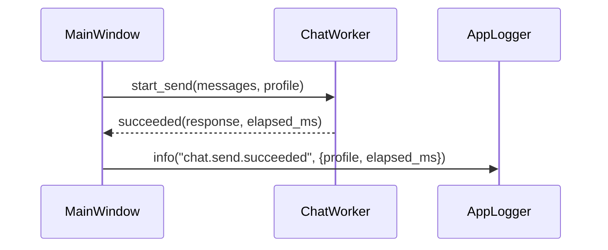
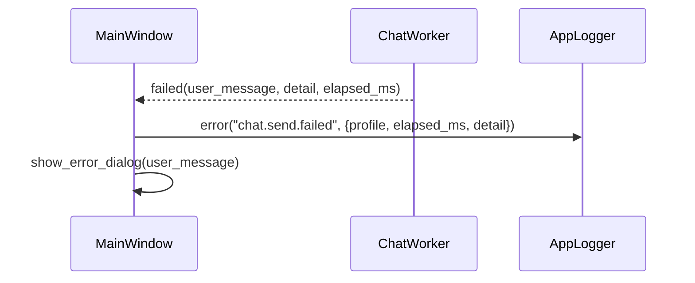
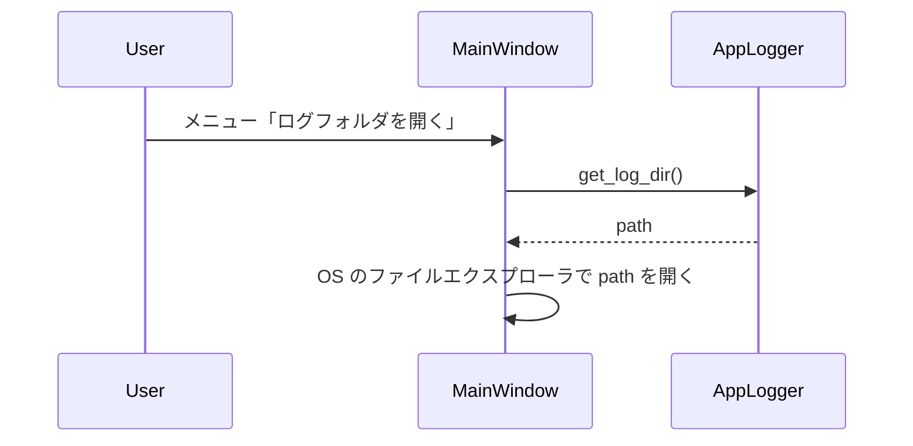
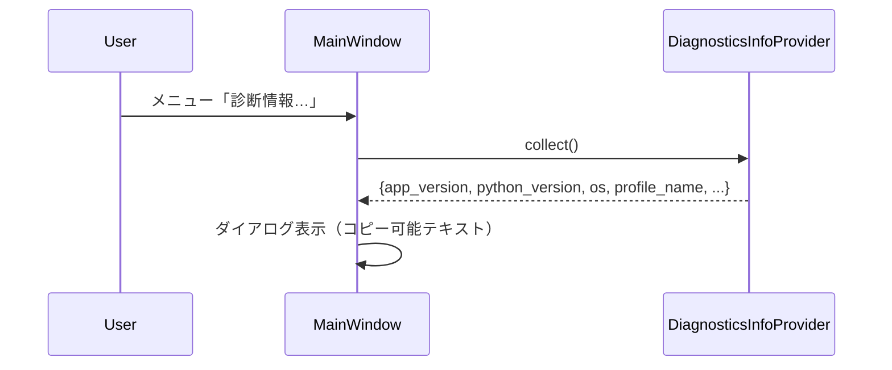

# Design Document

## Overview

本機能は、チャットクライアントに軽量なローカルログ出力と診断情報表示機能を追加し、障害発生時の原因調査を支援する。日常的に「何かおかしい」と相談を受けるサポート担当・社内 IT が、ユーザーの画面を直接見なくてもログと診断情報から状況を再現しやすくなることを狙う。

### Goals
- 代表的な操作（送信、設定変更など）とエラーについて、最低限のメタ情報をローカルファイルに一貫した形式で記録できること
- ログの ON/OFF を設定から制御できること（既定 ON）
- 「ログフォルダを開く」操作と、アプリバージョンや OS 情報等をまとめて確認できる診断ダイアログを提供すること

### Non-Goals
- SaaS ログ基盤や APM への送信、分散トレーシングなどの中央集約型観測基盤の導入
- PII を含む詳細なリクエスト本文ログ、モデル応答の全文保存
- 高度なメトリクスダッシュボードやリアルタイム監視 UI

## Architecture

### Existing Architecture Analysis
- UI は `PySide6` ベースで、メインウィンドウ `MainWindow` と各種ダイアログから構成される
- LLM との通信は `client.py` の `LlmClient` 実装を通じて行われ、送信処理は `QThread` を用いて非同期化されている
- 設定は `config.py` を経由して JSON ファイルに保存され、プロファイル機能は `profile_repository.py` によって抽象化されている

### Architecture Pattern & Boundary Map
パターン: 既存アプリに「アプリケーションログ」レイヤを薄く追加し、UI/ドメインロジックからは軽いファサード API のみを呼び出す構成とする。

- Domain/feature 境界:
  - ログ書き出しとその設定管理は「インフラ層（logging ファサード + 設定）」に集約
  - UI は「いつ」「どのレベルで」記録するかの判断のみを行い、ファイル形式やローテーションは知らない
  - 診断ダイアログは UI 層だが、実際の情報収集は小さなヘルパ（diagnostics モジュール）に委譲
- 新規コンポーネント:
  - `AppLogger`（ファサード）
  - `LoggingConfig`（設定値のうちログ関連部分）
  - `DiagnosticsInfoProvider`（バージョン・OS・Python などの情報取得）

概略図:

```text
UI(MainWindow, SettingsDialog, HelpMenu)
 ├── calls → AppLogger.info/error(event, meta)
 ├── menu 「ログフォルダを開く」
 └── menu 「診断情報…」

Infra
 ├── app_logger.py（AppLogger, LoggingConfig）
 ├── diagnostics.py（DiagnosticsInfoProvider）
 └── config.py（logging.* 設定の読み書き）
```

### Technology Stack

| Layer | Choice / Version | Role in Feature | Notes |
|-------|------------------|-----------------|-------|
| UI | PySide6 | メニュー・ダイアログ・ボタンなどの表示 | 既存構造を拡張 |
| Logging | Python 標準 `logging` | ローカルファイルへのログ出力 | ローテーションハンドラ利用を想定 |
| Diagnostics | Python 標準 `platform`, `sys` | OS / Python 情報取得 | 追加依存を増やさない |
| Config | 既存 `config.py` + JSON | logging.*/diagnostics.* の設定保持 | 後方互換を維持 |
| OS | Windows 10+ | ログフォルダオープン（エクスプローラ起動） | `subprocess` or `QDesktopServices` |

## System Flows

### Flow 1: 送信処理成功時のログ記録



- UI は「どのイベントをどういうキーで記録するか」を決める
- 実際のファイル I/O は `AppLogger` 内で完結する

### Flow 2: エラー発生時のログ記録



- `detail` は例外種別・HTTP ステータスなどセンシティブでない情報に限定する

### Flow 3: 「ログフォルダを開く」



### Flow 4: 診断情報ダイアログ



## Requirements Traceability

| Requirement | Summary | Components | Interfaces | Flows |
|-------------|---------|------------|------------|-------|
| FR-1 | 最低限のメタ情報をログ出力 | AppLogger, LoggingConfig | info/error | Flow 1, 2 |
| FR-2 | ログファイル管理（ローテーション等） | AppLogger | logger setup | - |
| FR-3 | ログ ON/OFF 制御 | LoggingConfig, SettingsDialog | is_enabled | Flow 1, 2 |
| FR-4 | ログフォルダオープン | AppLogger, MainWindow | get_log_dir | Flow 3 |
| FR-5 | 診断情報ダイアログ | DiagnosticsInfoProvider, MainWindow | collect() | Flow 4 |
| NFR-1 | センシティブ情報非保存 | AppLogger | log filtering | Flow 1, 2 |
| NFR-2 | パフォーマンス | AppLogger | non-blocking usage | Flow 1, 2 |
| NFR-3 | 運用性 | AppLogger, DiagnosticsInfoProvider | log/diag format | Flow 1–4 |

## Components and Interfaces

### Infra / Logging

#### AppLogger

| Field | Detail |
|-------|--------|
| Intent | アプリ全体のログ出力を一箇所に集約するファサード |
| Requirements | FR-1, FR-2, FR-3, FR-4, NFR-1, NFR-2, NFR-3 |

**Responsibilities & Constraints**
- ログレベル・出力先ディレクトリ・ローテーション設定を `LoggingConfig` から取得し、Python `logging` を初期化する
- `info(event: str, meta: dict)` / `error(event: str, meta: dict)` などのメソッドを提供し、UI/ドメインからは event 名とメタ情報のみ渡せばよい形にする
- `meta` からプロンプト本文や API キーなどは禁止キーをフィルタリングする
- ログフォルダパスの問い合わせ `get_log_dir() -> Path` を提供する

**Dependencies**
- Inbound: `MainWindow`, `SettingsDialog`, ワーカーからのエラー処理部
- Outbound: Python 標準 `logging`, ファイルシステム

**Contracts**
- Service [x] / API [ ] / Event [ ] / Batch [ ] / State [ ]

**Implementation Notes**
- ハンドラは `RotatingFileHandler` または日別ローテーションを利用し、設定値 `logging.max_file_size_mb` / `logging.rotation_keep_files` を反映する
- ログフォーマットは `"{timestamp} {level} {event} {meta_as_json}"` のようなシンプルな 1 行テキストとする

#### LoggingConfig

| Field | Detail |
|-------|--------|
| Intent | ログ関連設定の読み書きを一箇所にまとめる |
| Requirements | FR-2, FR-3, NFR-2, NFR-3 |

**Responsibilities & Constraints**
- `logging.enabled`, `logging.level`, `logging.dir`, `logging.max_file_size_mb`, `logging.rotation_keep_files` を `config.py` の `Config` に追加し、既定値付きで後方互換を保つ
- ログディレクトリが未作成の場合は作成するか、パス解決に失敗した場合はアプリ起動時に非致命エラーとして通知する

## Components and Interfaces – Diagnostics

#### DiagnosticsInfoProvider

| Field | Detail |
|-------|--------|
| Intent | 診断ダイアログ向けの情報を収集し、UI に渡す |
| Requirements | FR-5, NFR-3 |

**Responsibilities & Constraints**
- アプリバージョン（`pyproject.toml` などの一元管理値）、Python ランタイムバージョン、OS 名とバージョン、現在選択中プロファイル名などを取得してシリアライズ可能な dict へまとめる
- UI でそのまま貼り付けやすいテキスト表現（キー=値の一覧）も生成する
- 個人名や詳細なパスなど不要な情報は含めない

**Dependencies**
- Inbound: `MainWindow`（診断情報ダイアログ表示処理）
- Outbound: `sys`, `platform`, `config`, `profile_repository`（プロファイル名取得）

**Implementation Notes**
- 将来、サポート用にチケット番号等を紐付ける余地を残すため、出力フォーマットは過度に複雑にしない

## Error Handling

### Error Strategy
- ログ出力時の I/O エラーはアプリ動作のブロッカーとせず、標準出力または一時的なフォールバックに記録する
- ログフォルダオープンに失敗した場合は、ユーザーに簡潔なエラーダイアログを表示しつつ、エラー詳細はログに記録する
- 診断情報の収集で例外が発生した場合は、取得できた情報のみを表示し、欠損部分は「取得失敗」と明示する

### Monitoring
- ログ初期化時・ローテーション時のエラーを検知できるよう、`AppLogger` 自身も標準出力へ最小限の警告を出す
- 診断ダイアログの表示回数や、代表的なエラーイベントの件数はログから後追い確認できる

## Testing Strategy

- Unit Tests
  - `AppLogger` のフィルタリングロジック（センシティブキーが出力されないこと）
  - ローテーション設定が指定サイズ・世代数に従って動作すること（設定値ごとの境界値）
  - `DiagnosticsInfoProvider` が想定どおりのキーセットを返すこと
- Integration Tests
  - 送信成功/失敗フローで `AppLogger` が呼ばれ、ファイルに 1 行ログが追加されること
  - ログ ON/OFF 設定変更後の再起動で挙動が切り替わること
  - 「ログフォルダを開く」「診断情報…」メニューの動作スモーク
- E2E/UI Tests（手動も可）
  - 代表的な障害シナリオ（ネットワーク切断、無効 API キーなど）でログと診断情報から原因のあたりを付けられることを確認する


