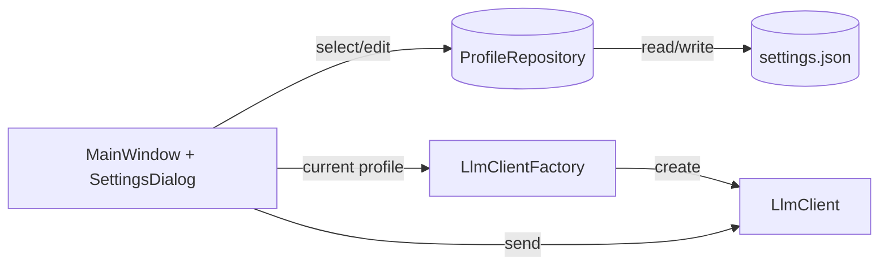
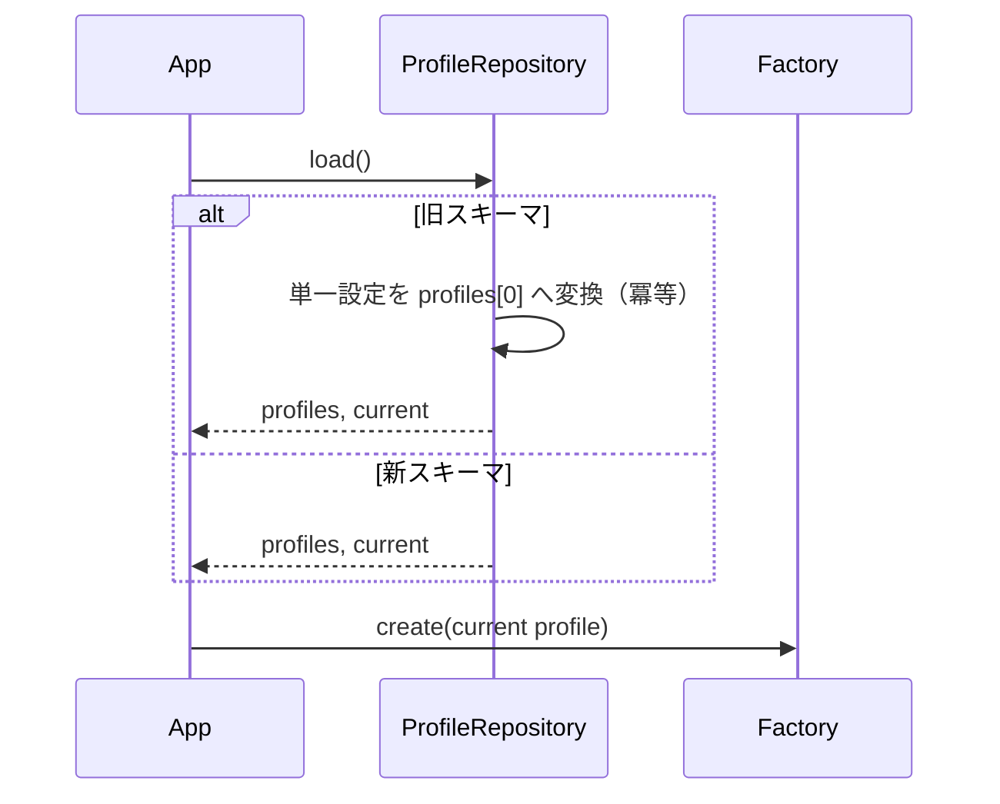
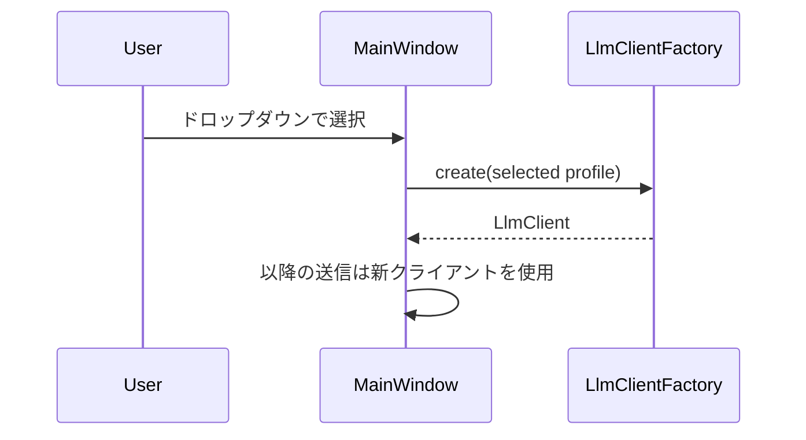

# Design Document

## Overview
本機能は複数の LLM 接続先（社内 OpenAPI 互換, ローカル Ollama 等）を「プロファイル」として保存・選択可能にし、切替を即時反映する。対象ユーザーは日常的に接続先を切り替える社内利用者。既存の単一設定を壊さず自動移行し、最低限の UI 追加で安全に運用開始できることを重視する。

### Goals
- プロファイル保存・選択・編集（追加/編集/削除）
- 現在選択中プロファイルの常時可視化
- 既存単一設定からの自動移行（冪等）

### Non-Goals
- 資格情報の新たな保管先（Credential Manager 等）への移行実装
- 観測性の拡充（v0.6 で扱う）
- RAG/添付/検索等のスコープ外機能

## Architecture

### Existing Architecture Analysis
- UI は PySide6 ベース。送信処理は LlmClient（OpenAI 互換/ Ollama 等）を介して実施
- 設定はローカルファイルへ永続化。起動時ロード、画面で編集、保存
- スレッド（QThread）やシグナル・スロットで送信中フリーズを回避済み

### Architecture Pattern & Boundary Map
選択したパターン: 設定リポジトリ＋ファクトリの薄い導入（既存構造最小変更）
- Domain/feature 境界: 設定（profiles, selection）、クライアント生成、UI プレゼンテーションを分離
- 新規コンポーネント: ProfileRepository, ProfileValidator, LlmClientFactory
- 既存パターン維持: UI はイベント駆動、送信処理はサービス層へ委譲

### Technology Stack
| Layer | Choice / Version | Role in Feature | Notes |
|-------|------------------|-----------------|-------|
| Frontend / UI | PySide6 | プロファイル選択 UI/設定ダイアログ | 既存に統合 |
| Services | LlmClientFactory | プロファイルに応じたクライアント生成 | 既存 LlmClient を再利用 |
| Data / Storage | JSON 設定 | profiles 配列の保存/読み込み | 原子的保存 |
| Infrastructure | Windows 10+ | 配布前提 | 8GB クラスで快適性 |

## System Flows

### 起動時マイグレーション（単一設定 → profiles[0]）

### プロファイル切替

## Requirements Traceability
| Requirement | Summary | Components | Interfaces | Flows |
|-------------|---------|------------|------------|-------|
| FR-1 | profiles 配列へ拡張 | ProfileRepository | load/save | 起動時 |
| FR-2 | 自動移行（冪等） | ProfileRepository | migrateIfNeeded | 起動時 |
| FR-3 | プロファイル選択 UI | MainWindow | Dropdown | 切替 |
| FR-4 | 追加/編集/削除 | SettingsDialog | CRUD | 設定 |
| FR-5 | 切替時に LlmClient 再生成 | LlmClientFactory | create(profile) | 切替 |

## Components and Interfaces

### ProfileRepository（Data, 実装済）
- Intent: 設定ファイルのロード/セーブ、旧→新の移行を一箇所へ集約
- Responsibilities
  - `load()` で JSON を読み込み、`profiles`/`current_profile_name` を返す。旧スキーマは冪等移行
  - `save(profiles, current)` または `save_full_config(Config)` で原子的保存を提供
  - `migrate_if_needed(data)` で辞書→`Config`＋移行を実行
- Contracts
  - State: profiles: list[Profile], current: str
  - Errors: ValidationError, IoError（UI に上位で伝達）
  - Facade: `config.load_config/save_config` は Repository を呼び出す薄い層に簡素化

### ProfileValidator（Domain）
- Intent: プロファイルの整合性と安全性の検証
- ルール
  - `name` 一意・非空、`type` ∈ {openai, ollama} など、`base_url` 形式、`model` 非空
  - `api_key` は任意。ログへ出力禁止

### LlmClientFactory（Service）
- Intent: 選択プロファイルから LlmClient を生成
- 前提
  - type=openai → SSE 対応クライアント、type=ollama → JSON Lines 対応
  - 送信中に切替要求が来た場合は UI でガード（ボタン disable など）

### MainWindow / SettingsDialog（UI）
- MainWindow
  - ドロップダウン（現在名表示、選択変更で Factory 経由で再生成）
  - 送信中は切替 UI disable、完了で enable
- SettingsDialog
  - プロファイル CRUD（名前重複バリデーション、確認ダイアログ）
  - 保存成功後に MainWindow へ通知→再生成

## Data Models
### Profile
- `name: str`（一意）
- `type: Literal["openai","ollama"]`
- `base_url: str`
- `model: str`
- `api_key: Optional[str]`
- 将来拡張: `proxy`, `timeout`, `ca_bundle_path` などは `extras` にネスト

### Settings
- `profiles: list[Profile]`
- `current_profile_name: str`
- 後方互換フィールドは読み取り専用で移行層が吸収

## Error Handling
- 入力エラー: フィールド単位でメッセージ表示。保存は不可、アプリは継続
- I/O 失敗: 非致命ダイアログ＋ログ。バックアップからの復旧手段を提示
- 切替中エラー: 現在のクライアントを維持し復帰。UI は再度 enable

## Testing Strategy
- Unit: Validator ルール、Repository の移行/保存、Factory の型別生成
- Integration: UI からの CRUD→保存→再起動で復元、切替時の送信ガード
- E2E: 代表的な 2〜3 プロファイルでの送受信スモーク

## Security Considerations
- API キーはログへ出力禁止、画面でも既定は伏字表示
- 将来の Credential Manager 移行を阻害しない API 設計（getter/setter の抽象化）

## Migration Strategy
1) 起動時に旧スキーマ検出→`profiles[0]` へ埋め込み、`current_profile_name` 設定  
2) バックアップ作成→原子的置換  
3) 冪等性確認（再起動しても同じ結果）  

