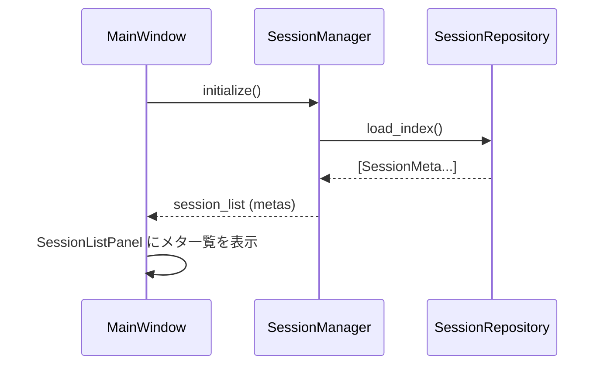
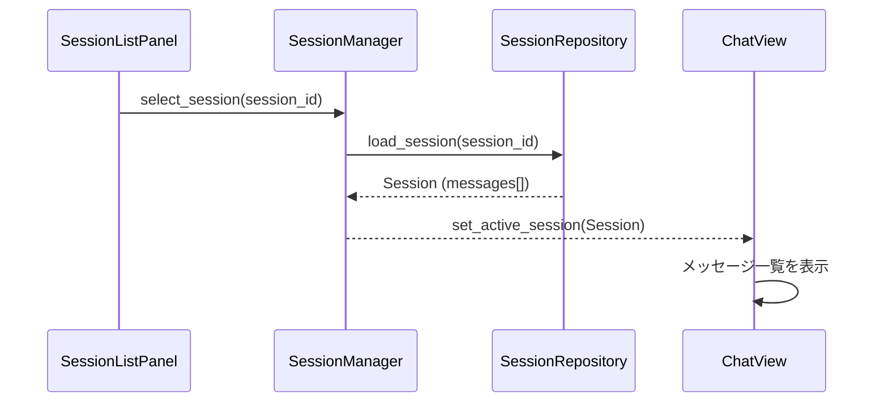
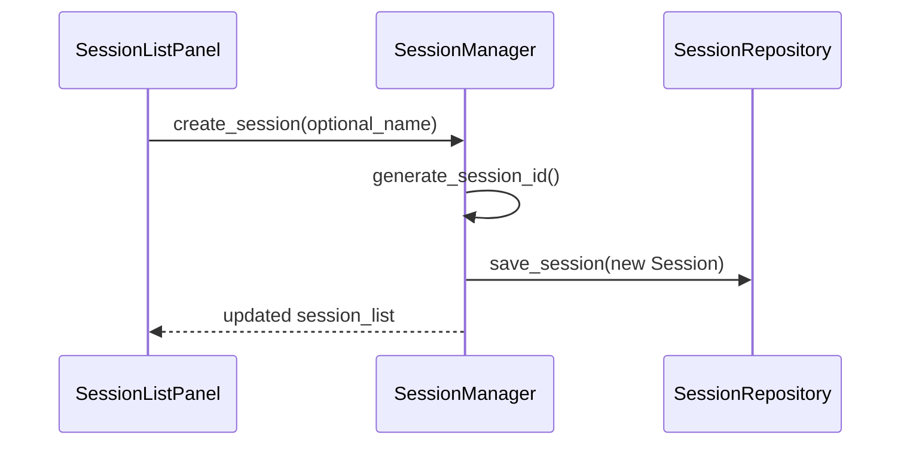
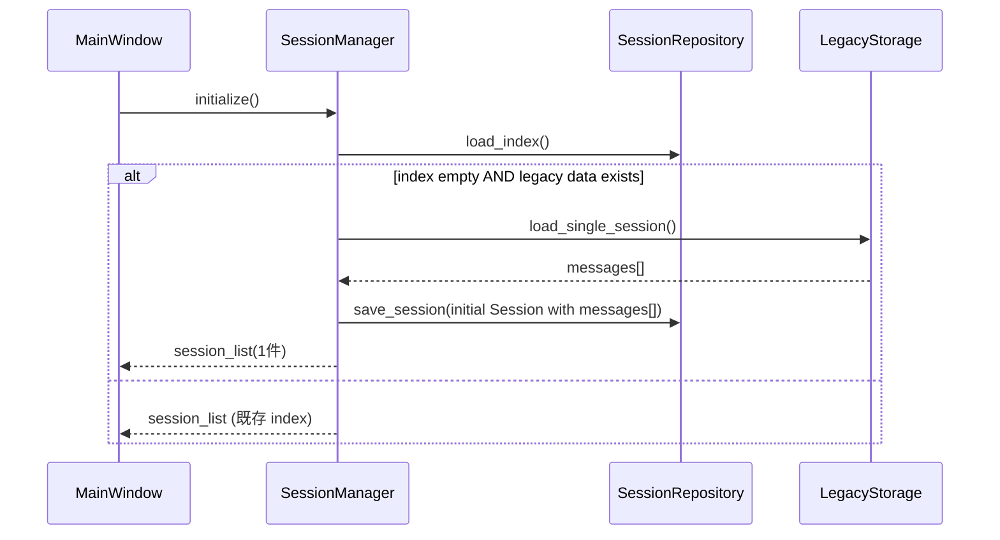

# Design Document

## Overview

本機能は、既存の「単一セッション」チャットクライアントを「複数セッション（会話スレッド）」を扱える形に拡張するための基盤を提供する。  
Session モデル・セッション一覧 UI・永続化戦略を揃えることで、ユーザーが案件／プロジェクト単位で会話履歴を整理しつつ、メモリ使用量と起動性能を維持することを狙う。

### Goals

- `Session` モデルを導入し、単一セッション時代のメッセージ履歴を含めて一貫したデータ構造に統合すること
- セッション一覧 UI によって、セッションの作成・名前変更・削除・切り替えを自然なフローで行えること
- 起動時はメタデータのみをロードし、選択されたセッションのみを全文ロードすることでメモリと起動時間を抑えること
- v1.0 までの単一セッション履歴を、少なくとも 1 つの初期セッションとして取り込めること

### Non-Goals

- 複数ユーザー／チーム共有／クラウド同期などのマルチユーザー対応
- セッション単位の全文検索やベクタ検索、RAG などの高度な検索機能
- セッションの自動アーカイブやバックアップスケジューラといった重い運用機能

## Architecture

### Existing Architecture Analysis

- UI は `PySide6` ベースで、メインウィンドウとチャットビュー、設定ダイアログなどから構成されている
- チャットメッセージの履歴と送信処理は、現在「単一セッション」を前提に設計されている（会話履歴は単一のストレージキー／ファイルに紐づいている想定）
- 設定やプロファイルは `config.py` / `profile_repository.py` によって永続化され、LLM との通信は `client.py` のクライアント実装に委譲されている

### Architecture Pattern & Boundary Map

パターン: 既存チャットドメインの外側に「Session 管理」レイヤを追加し、チャットビューは「現在選択中の Session の messages を表示する」だけに集中させる。

- 境界の考え方
  - Session 管理（一覧・作成・削除・永続化）は専用のモジュール／クラスに集約する
  - チャットビューは「アクティブな Session を切り替えるための signal」を受け取り、メッセージ一覧を差し替える
  - ストレージ層では、セッションメタデータ一覧と個別セッション本体（messages）を明確に分けて扱う

概略図:

```text
UI
 ├── MainWindow
 │    ├── SessionListPanel（左ペイン or ドロワー）
 │    └── ChatView（メッセージ一覧 + 入力欄）
 │
 └── SettingsDialog

Domain
 ├── SessionManager
 │    ├── list_sessions() / create / rename / delete
 │    ├── load_session(session_id)
 │    └── save_session(session)
 └── ChatController（既存）※アクティブ Session に紐付けて利用

Storage
 └── SessionRepository（JSON or SQLite）
      ├── load_index()  # メタデータ一覧
      ├── load_session(session_id)
      └── save_session(session)
```

### Technology Stack

| Layer | Choice / Role | Notes |
|-------|---------------|-------|
| UI | PySide6 | 既存メインウィンドウにセッション一覧パネルを追加 |
| Domain | SessionManager / ChatController | セッション切り替えとチャット送信の調停 |
| Storage | JSON または SQLite（既存方針に合わせて 1 つに統一） | メタインデックス + セッション本体 |
| ID 生成 | Python `uuid` など | ローカル一意な `session_id` 生成 |

## System Flows

### Flow 1: アプリ起動時のセッション一覧ロード



### Flow 2: セッション選択とメッセージ表示



### Flow 3: 新規セッション作成



### Flow 4: 単一セッションからの移行（初回起動）



## Requirements Traceability

| Requirement | Summary | Components | Flows |
|------------|---------|-----------|-------|
| FR-1 | Session モデル導入 | Session（ドメインモデル）, SessionRepository | Flow 2, 3, 4 |
| FR-2 | セッション一覧 UI | MainWindow, SessionListPanel, SessionManager | Flow 1, 2, 3 |
| FR-3 | セッション永続化 | SessionRepository, SessionManager | Flow 1, 2, 3, 4 |
| FR-4 | 起動時ロード戦略 | SessionRepository（load_index）, SessionManager | Flow 1 |
| FR-5 | セッション切り替え | SessionListPanel, SessionManager, ChatView | Flow 2 |
| FR-6 | 既存単一セッションからの移行 | SessionManager, LegacyStorage, SessionRepository | Flow 4 |
| NFR-1 | メモリ使用抑制 | load_index + lazy load session | Flow 1, 2 |
| NFR-2 | 起動性能 | index のみロード | Flow 1 |
| NFR-3 | UX / 操作性 | SessionListPanel の操作設計 | Flow 2, 3 |
| NFR-4 | 拡張性 | Session モデル + Repository の構造 | すべて |

## Components and Interfaces

### Domain: Session モデル

**Intent**: チャットセッション 1 件を表現するドメインオブジェクト。

推奨フィールド（実装言語に合わせてクラス or dataclass 等で表現）:

- `id: str`
- `name: str`
- `created_at: datetime`
- `updated_at: datetime`
- `messages: list[ChatMessage]`  ※既存メッセージ型を再利用

### Domain: SessionManager

| Field | Detail |
|-------|--------|
| Intent | セッション一覧とアクティブセッションを管理するドメインサービス |
| Requirements | FR-1〜FR-6, NFR-1〜NFR-4 |

**Responsibilities**

- セッション一覧の取得・更新（create/rename/delete）
- アクティブセッションの切り替えと、対応するメッセージのロード
- 永続化レイヤ（SessionRepository）との仲介
- 初回起動時の単一セッションデータからの移行処理

**Key Methods（案）**

- `list_sessions() -> list[SessionMeta]`
- `create_session(name: Optional[str]) -> Session`
- `rename_session(id: str, new_name: str) -> None`
- `delete_session(id: str) -> None`
- `load_session(id: str) -> Session`
- `save_session(session: Session) -> None`

### Storage: SessionRepository

| Field | Detail |
|-------|--------|
| Intent | セッションデータの永続化とロードを担当するリポジトリ |
| Requirements | FR-1〜FR-4, FR-6, NFR-1, NFR-4 |

**Responsibilities**

- セッションメタデータの一覧 (`SessionMeta`) をロード／保存する
- 個別セッション本体（`Session`）を ID ベースでロード／保存する
- JSON モードの場合は「index.json + session_<id>.json」、SQLite モードの場合は「sessions テーブル + messages テーブル」など、実装に応じてテーブル/ファイル分割する

**Key Methods（案）**

- `load_index() -> list[SessionMeta]`
- `save_index(metas: list[SessionMeta]) -> None`
- `load_session(id: str) -> Session`
- `save_session(session: Session) -> None`

### UI: SessionListPanel

**Intent**: 複数セッションをユーザーに見せ、選択・作成・名前変更・削除の操作を提供する UI コンポーネント。

**Responsibilities**

- `SessionMeta` の一覧を表示し、アクティブセッションをハイライトする
- 新規作成・名前変更・削除のユーザー操作を受けて `SessionManager` に伝える
- セッション選択イベントを発火してチャットビューにアクティブセッション変更を通知する

## Error Handling

- セッションロード／保存で I/O エラーが発生した場合は、ユーザーに簡潔なメッセージを表示しつつ、可能であれば他のセッション操作に影響を与えないようにする
- 移行処理中に旧データ形式を読み取れない場合は、エラーをログしつつ「履歴が移行できなかった」旨をユーザーに分かるようにする（ただしアプリ起動自体は継続）
- 不整合なセッションメタデータ（存在しない ID など）が検出された場合は、自動修復（孤立メタの除外）かユーザー向けのガイドを検討する

## Testing Strategy

- Unit Tests
  - `SessionManager` の create/rename/delete/切り替えロジック
  - `SessionRepository` の load_index / load_session / save_session が要件どおりに動作すること
- Integration Tests
  - アプリ起動時に index のみをロードし、セッション選択時にのみ messages がロードされること
  - 単一セッション履歴からの初回移行が一度だけ行われること
- UI / Manual Tests
  - 複数セッションを作成・名前変更・削除しても、チャット送信や表示に破綻がないこと
  - セッション数が増えても起動時間とメモリ使用が常識的な範囲に収まること


