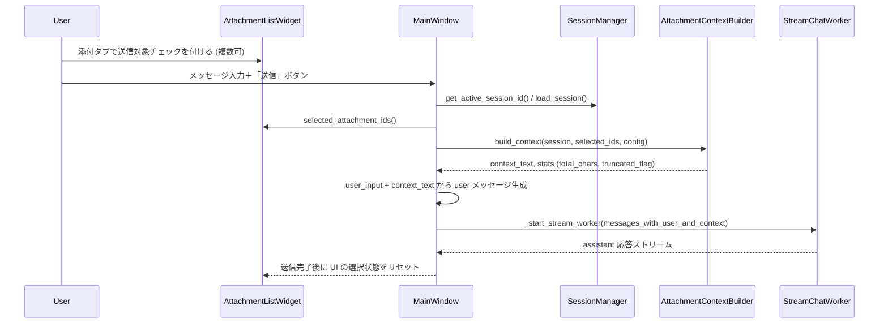
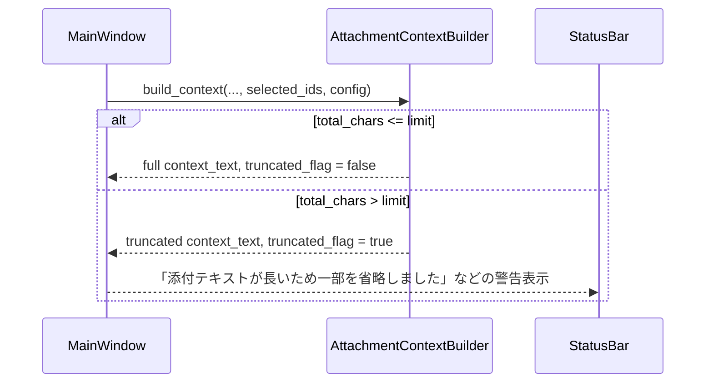

# Design Document

## Overview

本機能は、既存の「軽量ファイル添付」基盤と「添付・検索タブ」UIを前提に、  
ユーザーがセッション内の添付ファイルから「今回のメッセージで LLM に渡すもの」を明示的に選択できるようにし、  
通常のチャット送信フロー一本で「添付を利用した指示・質問」を完結させることを目的とする。

これにより、「質問する」専用ボタンや特別なフローを廃止しつつ、  
不要な添付を毎回コンテキストに載せてトークンを浪費する事態を避ける「ハイブリッド」な運用パターンを実現する。

### Goals

- 添付タブ上で、各添付ファイルを「今回の送信に含めるか」を複数選択できること
- メインの送信ボタンひとつで、テキスト＋選択された添付テキストを LLM に渡せること
- 送信完了後に選択状態をリセットし、意図しない「添付つけっぱなし状態」を防ぐこと
- 添付テキスト総量に対するソフト上限を設け、トークン浪費とレスポンス劣化を抑制すること

### Non-Goals

- RAG / ベクタ検索など、添付を恒常的なコーパスとして扱う機構の導入
- 添付テキスト抽出のアルゴリズム変更（対応拡張子や PDF 抽出戦略の刷新）
- LLM クライアント層のリクエスト形式やエンドポイント仕様の変更

## Architecture

### Existing Architecture Analysis

- 添付ドメイン:
  - `attachments.py` の `AttachmentManager` / `FileTextExtractor` が、セッション単位の添付・抽出テキストを管理している。
  - `models.Session` に `attachments` と `attachment_texts` があり、セッションごとに添付と抽出済みテキストが保存される。
- 添付 UI:
  - `attachment_widgets.py` の `AttachmentListWidget` が、添付一覧と「ファイルを添付」「要約」「質問する」「削除」ボタンを持つ。
  - `ui_main.py` の `MainWindow` が `AttachmentListWidget` をタブ内に配置し、各シグナルを `_on_attachment_*` ハンドラで受けている。
- 添付プロンプト:
  - `attachment_prompts.py` の `AttachmentPromptService` が、「要約」「ファイルQA」専用のメッセージリストを組み立て、`MainWindow._send_attachment_prompt` 経由でストリーミング送信している。
- 通常送信:
  - `MainWindow._on_send_clicked` が、現在の `self.messages` にユーザーメッセージを追加し、`_start_stream_worker` にそのまま渡している（添付テキストは介在していない）。

### Architecture Pattern & Boundary Map

採用するパターンは「UI で選択状態を管理し、添付コンテキストの組み立ては専用ドメインサービスに委譲する」構成とする。

```text
UI
 ├── MainWindow (ui_main.py)
 │    ├── MessageComposerWidget（既存: テキスト入力＋送信ボタン）
 │    └── AttachmentListWidget（既存拡張: 送信対象選択UI）
 │
 └── AttachmentSendIndicator（任意: ステータスバー表示など）

Domain
 ├── AttachmentManager（既存）
 ├── SessionManager / SessionRepository（既存）
 └── AttachmentContextBuilder（新規: 添付付き送信用コンテキスト組み立て）

Config
 └── Config（config.py 拡張: 添付付き送信の文字数上限など）
```

- `AttachmentListWidget` は「どの添付が今回の送信対象か」の UI 状態だけを持つ。
- 新規ドメインサービス `AttachmentContextBuilder`（仮名）は、セッションと選択された添付 ID から「LLM に渡す添付コンテキスト文字列」を生成し、テキスト長の上限管理と警告フラグ付与を担う。
- `MainWindow._on_send_clicked` は、送信直前に `AttachmentContextBuilder` を呼び出し、ユーザー入力テキストと添付コンテキストを結合したメッセージを LLM に渡す。

### Technology Stack

| Layer  | Choice / Role                                             | Notes                                              |
| ------ | --------------------------------------------------------- | -------------------------------------------------- |
| UI     | PySide6 (`AttachmentListWidget`, `MessageComposerWidget`) | 送信対象選択 UI と送信フローの統合                |
| Domain | `AttachmentContextBuilder`                                | 添付コンテキスト生成と文字数制御                  |
| Domain | 既存 `AttachmentManager` / `SessionManager`               | 添付メタデータと抽出テキストの取得                |
| Config | 既存 `Config`                                             | 添付付き送信の総文字数上限・警告閾値の設定        |
| Log    | 既存 `app_logger`                                         | 添付付き送信の統計・トリミング発生ログを記録      |

## System Flows

### Flow 1: 添付選択＋通常送信



### Flow 2: 添付テキスト超過時の制御



## Requirements Traceability

| Requirement | Summary                                      | Components                                   | Flows   |
| ----------- | -------------------------------------------- | -------------------------------------------- | ------- |
| FR-1        | 添付ファイルのチャット送信対象選択          | AttachmentListWidget                         | Flow 1  |
| FR-2        | 通常チャットへの添付コンテキスト統合        | MainWindow, AttachmentContextBuilder         | Flow 1  |
| FR-3        | 添付テキスト長の制御と警告                  | AttachmentContextBuilder, Config, StatusBar  | Flow 2  |
| FR-4        | 「質問する」ボタン廃止とフロー統合          | AttachmentListWidget, MainWindow             | Flow 1  |
| FR-5        | 既存機能との整合性                          | AttachmentManager, SessionManager            | Flow 1  |
| NFR-1       | 操作の分かりやすさ                          | AttachmentListWidget, ShortcutHelpDialog     | Flow 1  |
| NFR-2       | パフォーマンスとトークン効率                | AttachmentContextBuilder, LLM Client         | Flow 2  |
| NFR-3       | 実装の分離とテスト容易性                    | AttachmentContextBuilder (純粋ロジック層)    | Flow 1  |

## Components and Interfaces

### UI: AttachmentListWidget 拡張

| Field        | Detail                                                            |
| ------------ | ----------------------------------------------------------------- |
| Intent       | セッションに紐づく添付一覧と「今回送信に含めるか」の選択 UI を提供 |
| Requirements | FR-1, FR-4, FR-5, NFR-1                                          |

**Responsibilities & Constraints**

- 既存のツリー／リスト表示に「送信対象」列（チェックボックス）を追加するか、行単位のトグル UI を追加する。
- 選択状態はセッション内で一時的に保持するが、セッション保存 (`SessionManager.save_session_messages`) には含めない（送信後リセット前提のため）。
- 「質問する」ボタンとそのシグナル (`question_requested`) を廃止し、要約ボタンのみ残す。
- 新たに「送信対象の添付 ID を列挙するメソッド」を提供する:

```python
def selected_attachment_ids(self) -> list[str]:
    ...
```

- 行削除時（添付削除）には、対応する選択状態も自動的にクリアする。

### UI: MainWindow 送信フロー拡張

| Field        | Detail                                             |
| ------------ | -------------------------------------------------- |
| Intent       | 通常送信フローに添付コンテキストを統合する        |
| Requirements | FR-2, FR-3, FR-4, FR-5, NFR-2                      |

**Responsibilities & Constraints**

- `_on_send_clicked` 内で、以下の順序を追加する:
  - アクティブセッション ID を取得し、セッションをロードする。
  - `attachment_widget.selected_attachment_ids()` を呼び、選択された添付 ID リストを取得する。
  - セッションと ID リスト、Config を `AttachmentContextBuilder` に渡してコンテキストを取得する。
  - 取得したコンテキスト文字列を「ユーザー入力の前後どちらか」に結合して `Message(role="user")` を構築する（どちらに結合するかは実装時に明示）。
  - 送信完了後、`AttachmentListWidget` に対して「選択状態リセット」のメソッドを呼ぶ。
- 添付が 0 件選択の場合は、現行と同一の挙動（テキストのみ送信）とする。

### Domain: AttachmentContextBuilder（新規）

| Field        | Detail                                                      |
| ------------ | ----------------------------------------------------------- |
| Intent       | セッションと選択添付から LLM 用の添付コンテキストを生成する |
| Requirements | FR-2, FR-3, NFR-2, NFR-3                                    |

**Responsibilities & Constraints**

- 入力:
  - `session: Session`
  - `selected_ids: list[str]`
  - `config: Config`（文字数上限など）
- 振る舞い:
  - `selected_ids` に対応する `AttachmentMetadata` と `session.attachment_texts[id]` を取得する。
  - 各添付について、ファイル名・種別・サイズ・ページ数などのメタ情報とテキストをまとめたブロックを構築する。
  - 全ブロックの連結文字数が `config.attachment_send_max_chars`（仮）を超える場合、末尾をトリミングするか、ファイル単位でカットした上で `truncated=True` フラグをセットする。
- 出力（例）:

```python
@dataclass
class AttachmentContextResult:
    text: str
    total_chars: int
    truncated: bool
```

- `AttachmentContextBuilder` 自体は UI / LLM クライアントに依存せず、純粋な Python ロジックとして単体テスト可能にする。

### Config: 添付付き送信関連フィールド

| Field                        | Detail                                  |
| ---------------------------- | --------------------------------------- |
| Intent                       | 添付付き送信の文字数上限・挙動を制御    |
| Requirements                 | FR-3, NFR-2                             |

- 追加する設定例（名称は実装時に最終調整）:
  - `attachment_send_max_chars: int`（1 回の送信で添付テキストに使える総文字数の目安）
  - `attachment_send_truncate_notice_enabled: bool`（トリミング時に UI 通知を出すか）
- 既存の `history_max_chars` とは別系統として扱い、「LLM に渡すコンテキスト量」の制御に専念する。

## Data Models

- `Session` / `AttachmentMetadata` のスキーマは変更しない（送信対象選択は UI の一時状態として扱う）。
- 送信対象選択状態をセッション永続化に含めないことで、「送信し続けてしまう」リスクを構造的に排除する。

## Error Handling

- 選択された添付 ID のうち、`attachment_texts` にテキストが存在しない場合:
  - 当該添付はコンテキスト対象外とし、ステータスバーに「テキスト未抽出の添付は送信に含められません」と表示する。
- `attachment_send_max_chars` が極端に小さい／不正値の場合:
  - デフォルト値にフォールバックし、ログに警告を残す。
- `AttachmentContextBuilder` 内部で予期せぬ例外が発生した場合:
  - 添付コンテキストなし（テキストのみ）の送信にフォールバックし、ログに詳細を記録する。

## Testing Strategy

- Unit Tests
  - `AttachmentContextBuilder`:
    - 添付 0 件／1 件／複数件の組み合わせで、期待通りのコンテキストが構築されること。
    - 文字数上限を超えた場合に、`truncated=True` となり、テキストが切り詰められていること。
    - テキスト未抽出の添付が含まれている場合、それらがスキップされること。
- Integration Tests
  - 添付を 2 件以上追加し、1 件だけ選択して送信した場合、LLM に渡されるメッセージ（モック）にそのファイルだけの情報が含まれること。
  - 「質問する」ボタン削除後も、要約ボタンや既存添付操作（追加・削除）が動作すること。
  - 添付なし／添付ありの両ケースでストリーミング応答が正しく表示されること。
- UI / Manual Tests
  - 添付タブでの選択 UI が直感的であり、送信後に選択状態がクリアされることを確認する。
  - 大きな添付を選んだ場合でも、アプリが極端に重くならず、トリミング警告が表示されること。


