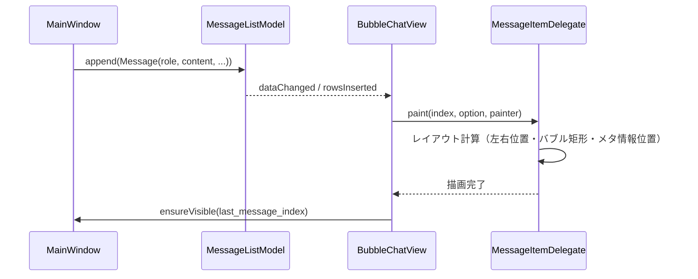
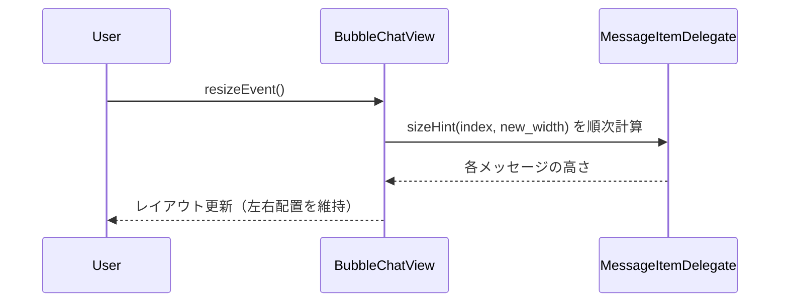
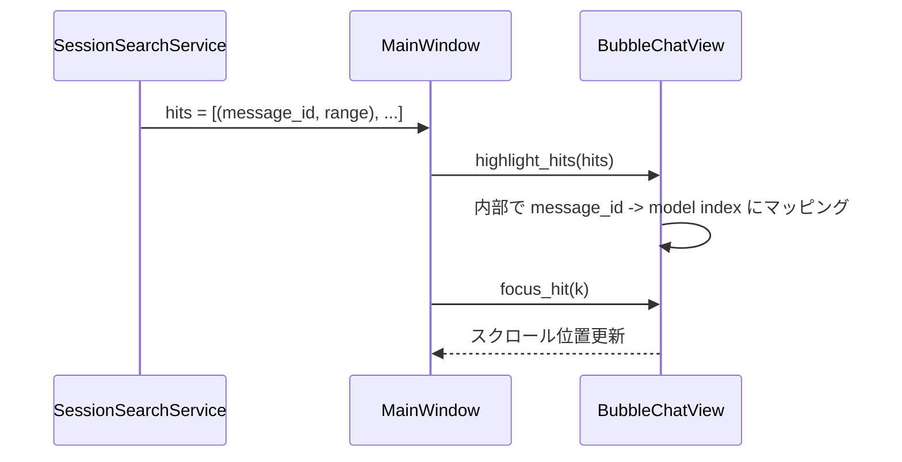

# Design Document

## Overview

本機能は、既存の PySide6 ベース LLM チャットクライアントのチャットビューに対して、  
User / Assistant / System などのロールごとに左右を分けた「チャットらしい」メッセージレイアウトとバブルデザインを導入し、  
長文の知的作業にも耐える読みやすさと、モダンな LLM チャットらしい視覚的体験を提供することを目的とする。

現在の実装は `QTextBrowser` に Markdown を流し込むだけの単一カラム表示であり、  
ロールごとの視覚的分離・メタ情報表示・添付やコードブロックを含む複雑なメッセージ構造を表現するには限界がある。  
本機能では、メッセージ単位のビューコンポーネントと、それらをスクロール可能なリストとして管理する新しいチャットビューを導入し、  
将来の機能追加（既読・スレッド・リアクション等）にも耐えられる土台を整える。

### Goals

- User メッセージを右側、Assistant メッセージを左側に配置し、ロールごとに明確に区別されたメッセージバブルを提供すること
- タイムスタンプ・ロールラベル・アイコンなどのメタ情報を、本文の可読性を損なわない形で一貫して表示すること
- 添付ファイル・画像・コードブロックなどのリッチコンテンツを、バブル内あるいは直下に整理して表示できる構造を用意すること
- 新しいレイアウト／スタイルは `theme.py` のトークンを拡張して管理し、ハードコードされたマジックナンバーを増やさないこと

### Non-Goals

- モデル呼び出しやメッセージ送信フロー（キューイング、リトライ等）の再設計
- マルチセッション機能やレイアウトモード（v1-6）の仕様変更
- 新しいメッセージタイプ（スレッド、リアクション、システム通知チャネルなど）の追加そのもの
- WebView ベースのレンダリングや、完全なリッチテキストエディタへの置き換え

## Architecture

### Existing Architecture Analysis

- チャットビュー:
  - `ui_main.py` の `MainWindow` が `QTextBrowser` (`self.chat_view`) を生成し、メッセージリストから Markdown を組み立てて `setMarkdown()` している。
  - メッセージモデルは `models.Message`（`role`, `content`）のみで、タイムスタンプや追加メタ情報は保持していない。
  - 検索ハイライトやスクロール制御は `ChatScrollController` と `QTextCursor` 操作で実現されている。
- レイアウト:
  - `MainLayoutContainer` がサイドバーとチャットペインの 2 分割レイアウトを管理しているが、チャット内部のレイアウトには関与しない。
- テーマ:
  - `theme.py` には `ThemeTokens` / `ColorTokens` / `TypographyTokens` / `SpacingTokens` があり、チャット全体・サイドバー・コンポーザの背景/文字色や余白をトークン化している。
  - ロールごとのバブル色・メタ情報の色・枠線・角丸などのトークンはまだ定義されていない。

既存の Markdown ベース実装は単純で安定している一方、左右レイアウトやバブルデザインを追加するには構造的に限界があるため、  
チャットビューのみを段階的に置き換える方針を取る。セッション管理や LLM クライアントロジックには極力手を入れない。

### Architecture Pattern & Boundary Map

- パターン:
  - 「メッセージ単位のコンポーネント」を持つチャットビューを導入し、レンダリング責務を `QTextBrowser` から切り離す。
  - ドメインモデル（`Message`）には最小限のメタ情報拡張のみ行い、UI 表現上の詳細（バブル形状、余白）はビュー層に閉じ込める。
  - テーマトークンは `ThemeRole` と組み合わせて、ロールごとの色・タイポグラフィ・スペーシングを参照する形に揃える。

```text
UI
 ├── MainWindow (ui_main.py)
 │    ├── ChatViewStack（新規: 旧 QTextBrowser と新チャットビューをカプセル化）
 │    │    ├── LegacyMarkdownChatView（既存 QTextBrowser ベース、段階移行用）
 │    │    └── BubbleChatView（新規: メッセージバブルレイアウト）
 │    └── ChatScrollController（既存: スクロール制御、必要に応じて拡張）
 │
 ├── BubbleChatView（新規モジュール or クラス）
 │    ├── MessageListView（QListView/QListWidget ベース）
 │    │    ├── MessageListModel（新規: Message 群を保持）
 │    │    └── MessageItemDelegate（新規: 左右バブル描画・メタ情報描画）
 │    └── AttachmentPreviewWidget / CodeBlockWidget（既存や共通ロジックを流用）
 │
 └── theme.py
      ├── ThemeTokens（既存拡張）
      └── ThemeRole
           ├── CHAT_BUBBLE_USER
           ├── CHAT_BUBBLE_ASSISTANT
           ├── CHAT_BUBBLE_SYSTEM
           └── CHAT_META
```

- 境界:
  - **MainWindow** はチャットビューを 1 つのコンポーネントとして扱い、メッセージリストの管理・送信・ストリーミングロジックは既存メソッドを再利用する。
  - **BubbleChatView** は「メッセージリストを受け取り、ロールに応じて左右レイアウトとスタイルを適用して描画する」責務に限定する。
  - **テーマ層** は UI 全体で共通利用されるため、既存トークンとの後方互換を維持しつつ、新しいバブル用トークンを追加する。

### Technology Stack

| Layer | Choice / Version             | Role in Feature                                          | Notes                        |
| ----- | ---------------------------- | -------------------------------------------------------- | ---------------------------- |
| UI    | PySide6 Widgets / QListView  | メッセージリストと左右バブルレイアウトの描画             | 既存 QTextBrowser を置き換え |
| UI    | QStyledItemDelegate          | バブル・メタ情報・添付プレビューのカスタム描画           | スクロール性能を考慮         |
| UI    | ChatScrollController（既存） | 自動スクロール・検索結果ジャンプの制御                   | 新チャットビュー対応に拡張   |
| Model | `models.Message`             | メッセージロールと内容（＋必要最小限のメタ情報）         | 後方互換を維持               |
| Theme | `theme.py` / `ThemeTokens`   | バブル色・メタ情報色・余白・角丸などをトークンとして管理 | ハードコードを排除           |

## System Flows

### Flow 1: メッセージ追加とバブル描画



### Flow 2: ウィンドウリサイズ時のレイアウト再計算



### Flow 3: 検索結果ジャンプとハイライト



## Requirements Traceability

| Requirement | Summary                              | Components                                             | Flows        |
| ----------- | ------------------------------------ | ------------------------------------------------------ | ------------ |
| FR-1        | 左右分離されたメッセージレイアウト   | BubbleChatView, MessageListModel, Delegate             | Flow 1, 2    |
| FR-2        | メタ情報表示と視認性                 | Delegate, ThemeTokens (CHAT_META), MessageListModel    | Flow 1       |
| FR-3        | 連続メッセージとスレッド感の整理     | Delegate, BubbleChatView                               | Flow 1, 2    |
| FR-4        | 添付・特殊コンテンツのバブル内表示   | Delegate, AttachmentPreviewWidget                      | Flow 1       |
| NFR-1       | 読みやすさと情報密度                 | Delegate, ThemeTokens                                  | Flow 1, 2    |
| NFR-2       | 一貫性とテーマトークンの活用         | theme.py, ThemeRole                                    | -            |
| NFR-3       | パフォーマンスとスムーズなスクロール | BubbleChatView, MessageListModel, ChatScrollController | Flow 1, 2, 3 |

## Components and Interfaces

### UI: BubbleChatView

| Field        | Detail                                                                       |
| ------------ | ---------------------------------------------------------------------------- |
| Intent       | メッセージリストを左右バブルレイアウトで表示するチャットビューコンポーネント |
| Requirements | FR-1, FR-2, FR-3, FR-4, NFR-1, NFR-3                                         |

**Responsibilities & Constraints**

- 内部に `QListView`（または `QListWidget`）と `MessageListModel` / `MessageItemDelegate` を保持する。
- `set_messages(messages: list[Message])` / `append_message(msg: Message)` / `update_last_message(content: str)` など、既存 `MainWindow` の利用パターンに合わせた API を提供する。
- 自動スクロールのポリシーは既存 `ChatScrollController` と協調させ、ユーザー操作でスクロール位置が固定されている場合には末尾への強制スクロールを避ける。

**Dependencies**

- Inbound: `MainWindow` からメッセージリストと検索結果、スクロール制御指示を受け取る。
- Outbound: `ChatScrollController`（スクロール制御）、`theme.py`（スタイルトークン）、添付／コード表示用の補助ウィジェット。

**Implementation Notes**

- 初期段階では `_update_chat_view` からの呼び出しパスを `BubbleChatView` の API に差し替え、旧 Markdown ベース表示と機能同等であることを確認した上で、旧実装を段階的に削除する。

### UI: MessageListModel

| Field        | Detail                                                   |
| ------------ | -------------------------------------------------------- |
| Intent       | `Message` オブジェクトのリストを Qt モデルとして公開する |
| Requirements | FR-1, FR-2, FR-3, FR-4, NFR-3                            |

**Responsibilities & Constraints**

- `QAbstractListModel` を継承し、`data(index, role)` でメッセージ内容とメタ情報を返す。
- `role`（user/assistant/system 等）、本文テキスト、タイムスタンプ、添付情報などを `Qt.UserRole` 以降のカスタムロールで提供する。
- メッセージ追加・更新時には最小限の `rowsInserted` / `dataChanged` シグナルを発行し、再描画コストを抑える。

### UI: MessageItemDelegate

| Field        | Detail                                                                 |
| ------------ | ---------------------------------------------------------------------- |
| Intent       | ロールごとの左右配置・バブル形状・メタ情報を描画するカスタムデリゲート |
| Requirements | FR-1, FR-2, FR-3, FR-4, NFR-1, NFR-2, NFR-3                            |

**Responsibilities & Constraints**

- `paint()` で、User は右側、Assistant は左側、System は中央寄せなどのレイアウトでバブルを描画する。
- 連続する同一ロールのメッセージに対して、上下余白や角丸を調整し「会話のまとまり」を表現する。
- バブル内に本文テキスト、コードブロック、添付プレビューを適切な余白付きで配置する。
- `sizeHint()` で幅に応じた高さを返し、ウィンドウリサイズ時にレイアウトが自然に再計算されるようにする。

### Theme: ThemeTokens / ThemeRole 拡張

| Field        | Detail                                                                               |
| ------------ | ------------------------------------------------------------------------------------ |
| Intent       | バブル・メタ情報用の色・タイポグラフィ・余白トークンを追加し、ハードコードを排除する |
| Requirements | NFR-1, NFR-2                                                                         |

**Responsibilities**

- `ColorTokens` に以下のようなフィールドを追加（例名、実際の命名は既存ルールに合わせる）:
  - `chat_bubble_user_bg`, `chat_bubble_user_text`
  - `chat_bubble_assistant_bg`, `chat_bubble_assistant_text`
  - `chat_bubble_system_bg`, `chat_bubble_system_text`
  - `chat_meta_text`, `chat_meta_muted_text`
- `SpacingTokens` にバブル内外の余白用トークン（`bubble_padding`, `bubble_gap` 等）を追加。
- 必要に応じて `ThemeRole` に `CHAT_BUBBLE_USER`, `CHAT_BUBBLE_ASSISTANT`, `CHAT_BUBBLE_SYSTEM`, `CHAT_META` を追加して意味づけする。

## Data Models

### Message 拡張（論理モデル）

- 既存の `Message` は `role: str` と `content: str` を主に扱っているが、左右レイアウトとメタ情報表示のために以下の拡張を検討する:
  - `created_at: datetime | None`（既存履歴との互換性のため Optional）
  - `display_role: str | None`（ロール名の表示用ラベル。将来のローカライズにも備える）
- ただし、既存履歴ファイルや API との互換性を優先し、**保存形式自体の変更は本フィーチャでは最小限**にとどめる。

### 検索ヒットマッピング

- セッション検索で利用している「メッセージ内インデックス」を、新チャットビュー側でも利用できるよう、`message_id`（リストインデックス）＋テキスト内オフセットのペアとして扱う。
- BubbleChatView は `highlight_hits(hits: list[tuple[int, tuple[int, int]]])` のような API を持ち、  
  メッセージレベルのスクロールとテキストレベルのハイライトを組み合わせる。

## Error Handling

- モデルとビューの不整合:
  - `MessageListModel` と `BubbleChatView` の間でインデックス不整合が発生した場合は、ログにエラーを残しつつ安全側で再構築（全メッセージ再バインド）する。
- テーマトークン不足:
  - 新たに追加したバブル関連トークンが未設定のテーマを読み込んだ場合、デフォルト値（既存チャット背景色＋わずかに異なる明度等）にフォールバックしつつログで警告する。
- 描画例外:
  - `MessageItemDelegate.paint()` 内で例外が発生した場合、当該メッセージのみプレーンテキスト表示にフォールバックし、アプリ全体のクラッシュを避ける。

## Testing Strategy

- Unit Tests
  - `MessageListModel` の追加・更新・削除操作に対する行数・データ整合性のテスト。
  - `MessageItemDelegate` の `sizeHint()` がメッセージ長・ウィンドウ幅に応じて単調増加することのテスト（極端に小さい/大きいケース含む）。
  - テーマトークンが未設定の場合にデフォルトにフォールバックするロジックのテスト。
- Integration / UI Tests
  - 代表的な会話シナリオ（User/Assistant/System 交互＋長文＋コード＋添付）をレンダリングしたスクリーンショット比較テスト（可能なら）。
  - ウィンドウリサイズ・メッセージ追加・セッション検索ジャンプを組み合わせたシナリオで、左右レイアウトとバブルグルーピングが崩れないことの確認。
  - 旧 Markdown ベースビューから新チャットビューへの切り替え後も、送信・ストリーミング・検索が従来どおり動作することを確認する回帰テスト。
- Manual / Visual Tests
  - 24 インチモニタの左右半分配置で、長文会話とコードレビューが 1〜2 時間見続けても目が疲れにくいかを実機で確認。
  - User/Assistant/System のバブル色・位置・メタ情報表示が直感的に理解できるか、非開発者による目視レビューを行う。
