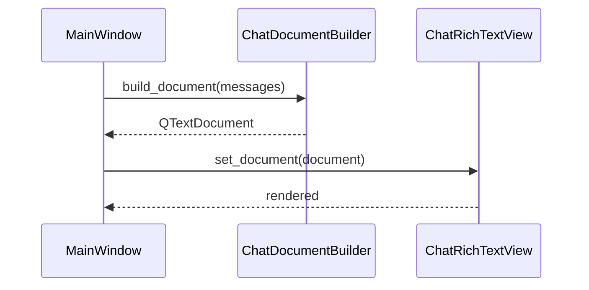
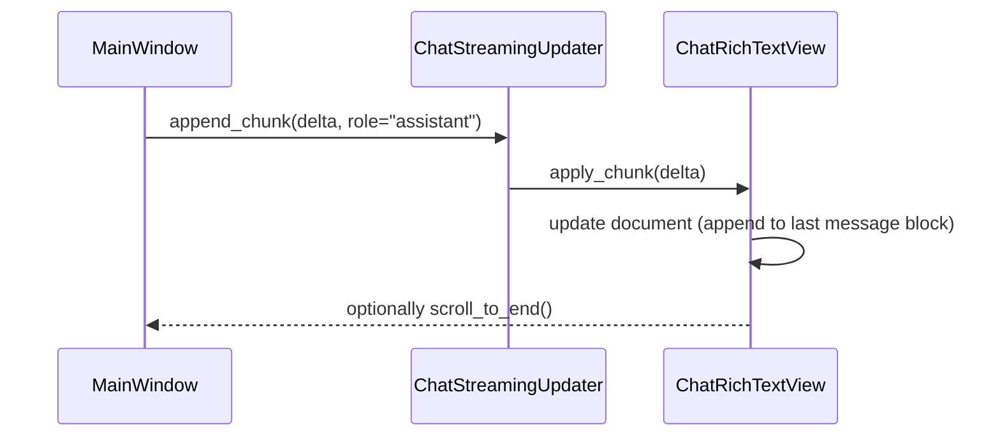
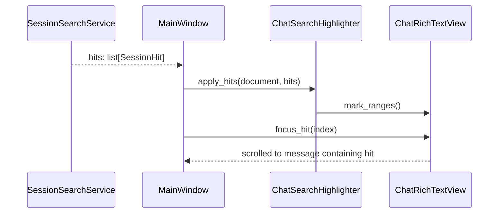

# Design Document

## Overview

本機能は、既存の PySide6 ベース LLM チャットクライアントのチャットビューを、  
「左右バブルレイアウト」「Markdown レンダリング」「テキスト選択・コピー」を同時に満たす形で再設計する。  
v1-12 で導入した `QListView`＋カスタム delegate ベースのビューは、見た目の左右バブルは実現できたが、  
Markdown レンダリングと複数メッセージにまたがるテキスト選択を犠牲にしており、日常利用の UX として破綻している。

本機能では、Qt の `QTextDocument` / `QTextBrowser` が持つリッチテキスト処理能力を活かしつつ、  
メッセージ単位で左右バブル風のレイアウトを実現できる専用ビューコンポーネントを導入し、  
ストリーミングや検索ハイライトとも矛盾しない構造へと整理する。

### Goals

- 左右バブルレイアウトを維持しつつ、従来の Markdown レンダリングと同等以上の表現力を確保すること
- マウスドラッグやキーボード操作による、複数メッセージにまたがるテキスト選択・コピーをサポートすること
- ストリーミング時の表示更新・自動スクロール・セッション内検索との連携を、単一のチャットビュー上で完結させること
- レンダリングロジックとビュー更新ロジックを分離し、単体テスト・統合テストから検証しやすい構造にすること

### Non-Goals

- LLM への送信フロー（メッセージ構造や API ペイロード）の仕様変更
- 添付コンテキスト生成、セッション／プロファイル／検索ドメインの仕様変更
- レイアウトモード（FOCUSED／COMPACT）の仕様変更や新規モード追加
- モバイル UI や WebView ベースへの移行

## Architecture

### Existing Architecture Analysis

- 現行 v1-12 ベース:
  - チャット表示は `BubbleChatView`（`QListView`＋`MessageListModel`＋`MessageItemDelegate`）に置き換え済み。
  - delegate が `QPainter.drawText` ベースで描画しているため、Markdown はプレーンテキスト化され、文字選択も行単位の描画に過ぎない。
  - セッション内検索はメッセージ ID 単位のハイライト（枠線強調）として実装されているが、テキストレベルのハイライトとは乖離している。
- 従来 (v1-6 以前):
  - `QTextBrowser` に対して `_update_chat_view()` が Markdown 文字列を組み立てて `setMarkdown` していた。
  - これによりテキスト選択・コピー・検索ハイライトはシンプルに実現できていたが、左右バブルレイアウトの表現力は低かった。

以上から、**「左右バブルのために Markdown と選択を捨てた」**という構造的な歪みが生じているため、  
チャットビューの基盤そのものを `QTextDocument` ベースに再構成する必要がある。

### Architecture Pattern & Boundary Map

- 選択されたパターン:
  - 単一の `QTextBrowser` 派生コンポーネント（`ChatRichTextView` 仮称）を採用し、  
    内部の `QTextDocument` にメッセージごとのブロック／フレームを構築する。
  - メッセージごとの左右配置・背景色・余白は、HTML＋CSS もしくは `QTextBlockFormat`／`QTextCharFormat` の組み合わせで表現する。
  - ドキュメントの構築ロジックはビューから分離し、`ChatDocumentBuilder` サービスとしてテスト可能にする。

```text
UI
 ├── MainWindow (ui_main.py)
 │    ├── ChatRichTextView（新規: QTextBrowser ベースのチャットビュー）
 │    └── ChatScrollController（既存: スクロール制御、調整のみ）
 │
 └── Rendering / Helpers
      ├── ChatDocumentBuilder（新規: メッセージ列 → QTextDocument 構築）
      ├── ChatStreamingUpdater（新規: ストリーミング時のドキュメント追記ポリシー）
      └── ChatSearchHighlighter（新規: SessionHit → ハイライト適用）
```

- 境界:
  - `MainWindow` はメッセージリストと検索ヒット、ストリーミング増分を `ChatRichTextView` 系の API に渡すだけとし、  
    具体的な Markdown 処理やカーソル操作はビュー側コンポーネントに閉じ込める。
  - ドメインモデル `Message` や `SessionHit` の構造は変更せず、変換ロジックを専用ビルダに集約する。

### Technology Stack

| Layer | Choice / Version           | Role in Feature                                              | Notes                        |
|-------|----------------------------|--------------------------------------------------------------|------------------------------|
| UI    | PySide6 `QTextBrowser`     | チャットビュー本体。リッチテキスト描画・選択・コピーを担当    | 既存依存を活用               |
| UI    | `QTextDocument` / Cursor   | メッセージブロック挿入、Markdown 断片の組み立て、ハイライト  | Builder/Highlighter で利用  |
| UI    | ChatScrollController       | 自動スクロールポリシーの維持                                | 既存クラスを再利用           |
| Logic | ChatDocumentBuilder        | `list[Message]` → `QTextDocument` 構築                       | 新規                         |
| Logic | ChatSearchHighlighter      | `list[SessionHit]` → ドキュメント内ハイライト               | 新規                         |
| Logic | ChatStreamingUpdater       | ストリーミング増分を安全に追記するポリシー                  | 新規（または Builder 内部） |

## System Flows

### Flow 1: メッセージ履歴ロード時の表示構築



### Flow 2: ストリーミング応答中の更新



### Flow 3: セッション内検索のハイライトとスクロール



## Requirements Traceability

| Requirement | Summary                            | Components                                   | Flows          |
|------------|------------------------------------|----------------------------------------------|----------------|
| FR-1       | 左右バブルレイアウト＋単一ビュー   | ChatRichTextView, ChatDocumentBuilder        | Flow 1         |
| FR-2       | Markdown レンダリング互換          | ChatDocumentBuilder, ChatRichTextView        | Flow 1, 2      |
| FR-3       | テキスト選択とコピー               | ChatRichTextView                             | Flow 1, 2      |
| FR-4       | ストリーミングとの統合             | ChatStreamingUpdater, ChatRichTextView       | Flow 2         |
| FR-5       | 検索ハイライトとの整合性           | ChatSearchHighlighter, ChatRichTextView      | Flow 3         |
| NFR-1      | パフォーマンス／リソース           | ChatDocumentBuilder, ChatRichTextView        | Flow 1, 2, 3   |
| NFR-2      | UX 一貫性と可読性                  | theme.py, ChatRichTextView                   | Flow 1, 2      |
| NFR-3      | 拡張性とテスト容易性               | 全コンポーネント                             | 全体           |

## Components and Interfaces

### UI: ChatRichTextView

| Field        | Detail                                                              |
|-------------|---------------------------------------------------------------------|
| Intent      | `QTextBrowser` ベースの単一チャットビューとして全文を表示する        |
| Requirements| FR-1, FR-2, FR-3, FR-4, FR-5, NFR-1, NFR-2                           |

**Responsibilities & Constraints**
- 内部に `QTextDocument` を保持し、メッセージごとのブロック／フレームを挿入する。
- `set_messages(messages: list[Message])` / `append_message(msg: Message)` / `update_stream_chunk(delta: str)` といった API を公開する。
- テキスト選択・コピーは `QTextBrowser` 標準機能を利用し、特別なカスタム挙動は極力追加しない（バブル装飾で邪魔しない）。
- 検索結果ハイライトやフォーカス移動用に、`highlight_ranges(hits: list[SessionHit])` / `focus_hit(index: int)` を提供する。

### Logic: ChatDocumentBuilder

| Field        | Detail                                                           |
|-------------|------------------------------------------------------------------|
| Intent      | メッセージ列から、左右バブル風レイアウトを持つ `QTextDocument` を構築 |
| Requirements| FR-1, FR-2, NFR-1, NFR-2                                         |

**Responsibilities**
- 各 `Message` を 1 ブロック（またはフレーム）として挿入し、User は右寄せ＋ユーザーバブルスタイル、Assistant は左寄せ＋アシスタントバブルスタイルを適用する。
- Markdown 本文については、一時的な `QTextDocument` で `setMarkdown` した結果を `QTextDocumentFragment` としてコピーする方式を採用し、Markdown パーサに依存した HTML 生成を行わない。
- テーマトークン（色・余白・フォント）から CSS あるいは `QTextBlockFormat` を生成し、バブルの背景・パディング・角丸を表現する。

### Logic: ChatStreamingUpdater

| Field        | Detail                                                         |
|-------------|----------------------------------------------------------------|
| Intent      | ストリーミング増分を安全に最後のメッセージブロックへ追加する   |
| Requirements| FR-4, NFR-1                                                    |

**Responsibilities**
- ストリーミング開始時に「対象メッセージブロック」のカーソル位置を記録し、増分テキストをそこに追記する。
- チャンクが Markdown 断片である場合にも、Markdown として再解釈するのか、プレーンテキストとして扱うのかの方針を明示する（基本はプレーンテキスト＋最終整形時のみ Markdown 再構築）。
- 自動スクロールの呼び出しタイミングを制御し、チャンクごとに無駄な全体再描画を発生させない。

### Logic: ChatSearchHighlighter

| Field        | Detail                                                        |
|-------------|---------------------------------------------------------------|
| Intent      | `SessionHit` 情報をもとにチャットビュー内のテキストをハイライト |
| Requirements| FR-5, NFR-1                                                   |

**Responsibilities**
- `SessionHit(message_index, start, length)` を、ドキュメント内のオフセットにマッピングするためのインデックス構造を維持する。
- ハイライトは `QTextCharFormat` を用いて適用し、ユーザーの通常の選択とは別レイヤで管理する。
- ヒットが多数ある場合にも、必要最小限の範囲に対してのみフォーマットを適用する。

## Data Models

本機能では `models.Message` や `SessionHit` などの既存ドメインモデルを再利用し、  
データ構造の変更は行わない方針とする。ただし、以下の補助情報が内部的に必要となる:

- メッセージインデックス → ドキュメント上のブロック範囲のマッピング（内部用）
- セッション検索結果（`SessionHit`）とドキュメント内オフセットの対応表

これらは `ChatDocumentBuilder`／`ChatSearchHighlighter` 内部の実装詳細に留め、外部には公開しない。

## Error Handling

- Markdown 変換失敗:
  - 個別メッセージの Markdown → フラグメント変換に失敗した場合は、そのメッセージのみプレーンテキストとして挿入し、ログに警告を残す。
- ストリーミング更新中の整合性崩れ:
  - 予期せぬストリーミング終了やキャンセルで増分が不整合になった場合、最後のメッセージを再構築してからドキュメント全体を再描画するフォールバックを用意する。
- ハイライト適用失敗:
  - `SessionHit` とドキュメント構造の不整合が発生した場合は、そのヒットをスキップしつつログで検知し、ユーザーには「ヒット数が一部反映されない」ような致命的 UX を避ける。

## Testing Strategy

- Unit Tests
  - `ChatDocumentBuilder` に対して、User/Assistant/System のメッセージ列から期待どおりの左右配置・スタイル属性を持つドキュメントが生成されることをテストする（ブロック数・アラインメント・色など）。
  - 代表的な Markdown 断片（見出し／リスト／コードブロック／表）を含むメッセージに対し、`QTextDocument` レベルで構造が壊れていないことを確認する。
  - `ChatSearchHighlighter` に対して、`SessionHit` → ドキュメント上のハイライト適用が、メッセージインデックスとテキスト位置に対して正しく行われることをテストする。

- Integration / UI Tests
  - MainWindow 経由でメッセージ履歴をロードし、バブルレイアウト＋Markdown 表示＋テキスト選択・コピーの組み合わせが要件通り動作することを確認する。
  - ストリーミングシナリオ（チャンク追加 → 完了）において、表示が破綻せず、自動スクロールポリシーが守られていることをテストする。
  - セッション内検索シナリオで、ヒットのハイライトとスクロール挙動が要件どおりであること、通常のテキスト選択との干渉がないことを確認する。

- Regression Tests
  - v1-12 以前のチャット関連テスト（送信・履歴保存・検索・テーマ）のうち、本機能で影響を受けるケースを洗い出し、新チャットビューでも同等以上の結果が得られることを確認する。


