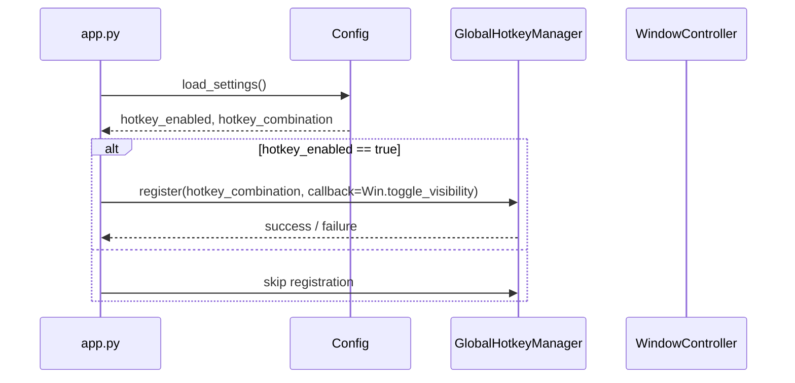
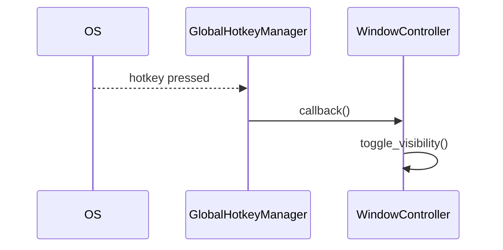
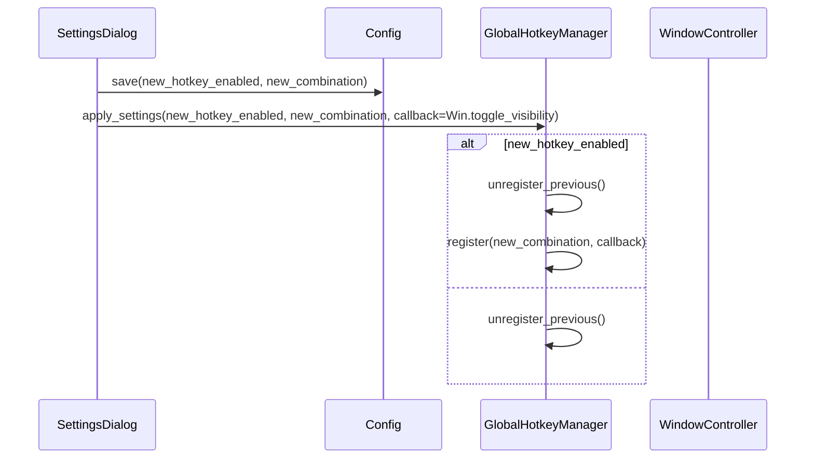

# Design Document

## Overview

本機能は、Windows 上の PySide6 ベース LLM クライアントに「グローバルホットキーで即座に呼び出せるワークステーション」という性格を与えるための UI/OS 連携レイヤを追加する。  
既存の「常に最前面」設定と矛盾しないウィンドウトグル挙動と、OS フック失敗時にもアプリ全体を巻き添えにしない安全設計を両立させることが目的である。

### Goals

- バックグラウンドや最小化状態からでも、グローバルホットキー 1 回でメインウィンドウを前面化し、すぐに入力できる状態にすること
- 同じホットキーで表示／最小化をトグルできること（「呼び出し → 片付け」がワンキーで完結する）
- 設定画面からホットキーの変更／無効化ができ、再起動なしで反映されること
- ホットキー登録に失敗しても、エラーがログと UI に明示され、チャット機能そのものは継続できること

### Non-Goals

- OS ごとに異なる高度なウィンドウ管理機能（仮想デスクトップ間移動、マルチモニタ最適化など）
- キーボードマクロ／スニペットツールのような拡張機能
- Windows 以外（macOS, Linux）のグローバルホットキー実装

## Architecture

### Existing Architecture Analysis

- UI は `PySide6` の `QMainWindow` ベースで、チャットビュー／セッション一覧／設定ダイアログを持つ
- アプリ起動・終了処理は `app.py`・`ui_main.py` 周辺で行われている
- 設定値（`always_on_top` など）は `config.py` と設定ダイアログから読み書きされている
- 現状は OS レベルのグローバルホットキー登録は行っておらず、「常に最前面」フラグのみでウィンドウ表示優先度を制御している

### Architecture Pattern & Boundary Map

パターンとしては、既存 UI/設定ロジックの外側に「OS ホットキー専用のインフラ層コンポーネント」を追加し、アプリケーションロジックとは疎結合に保つ。

- `GlobalHotkeyManager`（インフラ層）
  - OS 依存のホットキー登録・解除を一手に引き受けるクラス
  - ホットキー押下時に「アプリケーション側のコールバック」を呼ぶだけに限定する
- `WindowController`（UI / アプリケーション層）
  - 現在のウィンドウ状態（表示／最小化・フォーカス／非フォーカス）と「常に最前面」設定を考慮し、`toggle_visibility()` のような API でウィンドウトグルを提供する
- 設定層（`SettingsDialog` + `config.py`）
  - ホットキーのキーコンビネーションと有効／無効フラグを永続化し、起動時の `GlobalHotkeyManager` 初期化に渡す

概略イメージ:

```text
          +-------------------+
          |   Settings UI     |
          | (SettingsDialog)  |
          +---------+---------+
                    |
                    v
          +-------------------+
          |    config.py      |
          | hotkey settings   |
          +---------+---------+
                    |
     +--------------+--------------+
     |                             |
     v                             v
+------------+            +-------------------+
| Window     |   signal   | GlobalHotkeyManager|
| Controller |<-----------|  (OS hook wrapper) |
+------------+            +-------------------+
     |
     v
+------------+
| QMainWindow|
+------------+
```

### Technology Stack

| Layer  | Choice / Role                                          | Notes                                            |
| ------ | ------------------------------------------------------ | ------------------------------------------------ |
| UI     | PySide6 `QMainWindow`, `QWidget`                       | 既存メインウィンドウにトグル API を追加          |
| Infra  | `GlobalHotkeyManager`（Python ライブラリ or 自前実装） | Windows のグローバルホットキー API をラップ      |
| Config | 既存 `config.py`                                       | ホットキー有効／無効・キーコンビネーションを保存 |

本設計では、「OS API に直接張り付くコード」は `GlobalHotkeyManager` に閉じ込め、テストしにくい部分を明確に隔離する。

## System Flows

### Flow 1: アプリ起動時のホットキー登録



### Flow 2: ホットキー押下によるウィンドウトグル



### Flow 3: 設定変更時のホットキー再登録



## Requirements Traceability

| Requirement | Summary                       | Components                                         | Flows        |
| ----------- | ----------------------------- | -------------------------------------------------- | ------------ |
| FR-1        | グローバルホットキー基本動作  | GlobalHotkeyManager, WindowController, QMainWindow | Flow 1, 2    |
| FR-2        | ホットキー設定                | SettingsDialog, Config, GlobalHotkeyManager        | Flow 1, 3    |
| FR-3        | 登録・解除ライフサイクル      | GlobalHotkeyManager, app.py                        | Flow 1, 3    |
| FR-4        | 競合時エラーハンドリング      | GlobalHotkeyManager, Logging                       | Flow 1, 3    |
| FR-5        | 常に最前面との整合性          | WindowController, Config, QMainWindow              | Flow 2       |
| FR-6        | 既存 UI／セッションとの整合性 | WindowController, Chat UI                          | Flow 2       |
| NFR-1       | 安定性                        | GlobalHotkeyManager の失敗時フォールバック         | Flow 1, 2, 3 |
| NFR-2       | パフォーマンス                | 軽量なホットキー監視とウィンドウ操作               | Flow 2       |
| NFR-3       | UX / 操作性                   | SettingsDialog の UI, デフォルトキー選定           | Flow 3       |
| NFR-4       | ログとトラブルシュート        | Logging, Diagnostics                               | Flow 1, 3    |

## Components and Interfaces

### `GlobalHotkeyManager`（Infra）

| Field        | Detail                                                            |
| ------------ | ----------------------------------------------------------------- |
| Intent       | OS 依存のグローバルホットキー登録・解除をラップするコンポーネント |
| Requirements | FR-1〜FR-4, NFR-1, NFR-2, NFR-4                                   |

**Responsibilities**

- ホットキー登録・解除を行い、登録結果を呼び出し側に返す
- 押下時にアプリケーション側コールバック（`Callable[[], None]`）を呼ぶ
- 競合や OS エラー発生時に、明示的な例外 or リターン値で通知しつつ、アプリ全体を落とさない

**Key Methods（案）**

- `register(hotkey: str, callback: Callable[[], None]) -> bool`
- `unregister() -> None`
- `apply_settings(enabled: bool, hotkey: str | None, callback: Callable[[], None]) -> None`

### `WindowController`（UI / Application）

| Field        | Detail                                                           |
| ------------ | ---------------------------------------------------------------- |
| Intent       | メインウィンドウの表示／最小化・フォーカス制御を一箇所にまとめる |
| Requirements | FR-1, FR-5, FR-6, NFR-1, NFR-2, NFR-3                            |

**Responsibilities**

- 「表示中か」「最小化か」「フォアグラウンドか」を判定し、`toggle_visibility()` を通じて直感的なトグルを提供
- 「常に最前面」設定が有効な場合でも、トグル挙動が破綻しないようにウィンドウフラグを組み合わせる
- 将来のグローバルホットキー拡張（例: 別ウィンドウを開く）時にもインターフェースを保ちやすくする

**Key Methods（案）**

- `toggle_visibility() -> None`
- `show_and_focus() -> None`
- `minimize_or_hide() -> None`

### Settings / Config 連携

- `config.py`
  - `hotkey_enabled: bool`
  - `hotkey_combination: str` 例: `"Ctrl+Alt+Space"`
- `SettingsDialog`
  - UI 上でのホットキー表示・編集ウィジェット
  - 保存時に `Config` へ書き出し、`GlobalHotkeyManager.apply_settings` を呼び出す

## Error Handling

- ホットキー登録に失敗した場合（競合など）、`GlobalHotkeyManager.register` は `False` を返し、ユーザーには設定画面 or 通知ダイアログで「他アプリと競合している可能性」を明示する
- OS 例外が発生した場合はログに詳細を出しつつ、ホットキー機能のみ無効化し、チャット機能は継続する
- 無効化時には、次回起動でも同じ不整合が繰り返されないように、設定値と実際の登録状態のギャップをログで可視化する

## Testing Strategy

- Unit Tests
  - `GlobalHotkeyManager` の登録／解除ロジック（OS API 部分はモック）
  - `WindowController.toggle_visibility` の状態遷移（表示 → 最小化 → 表示）
- Integration Tests
  - 設定変更後に再起動なしでホットキーの変更が反映されるか
  - ホットキー競合時にエラーが UI とログに出つつ、アプリが継続するか
- Manual / UI Tests
  - 実機環境でのホットキー挙動（バックグラウンド / 最小化 / フルスクリーンアプリ使用中など）
  - 「常に最前面」ON/OFF 組み合わせでのトグル挙動確認
