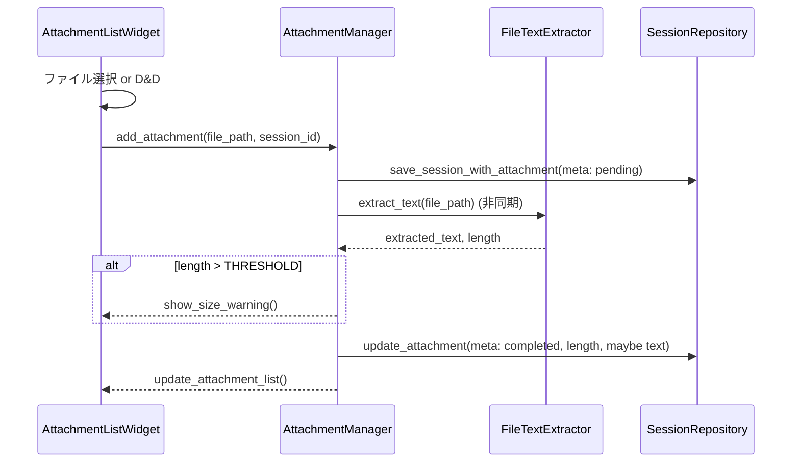
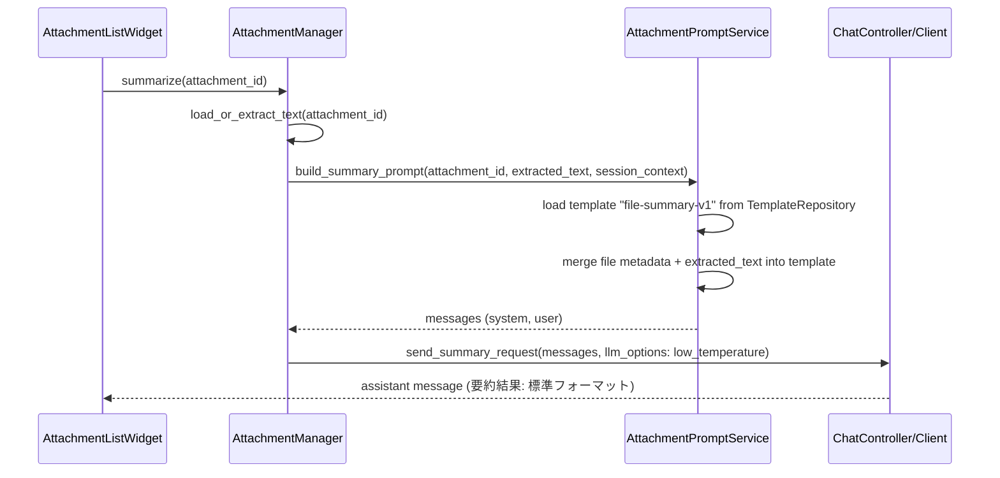
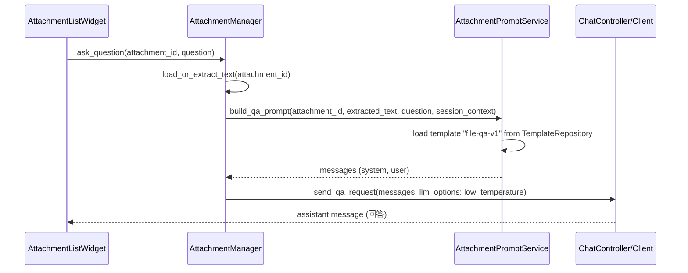

# Design Document

## Overview

本機能は、既存の PySide6 ベース LLM チャットクライアントに「軽量ファイル添付（テキスト抽出＋要約/Q&A）」を追加し、RAG や常駐インデックスなしでドキュメントを読ませられるようにする。  
PDF / テキスト / Markdown をセッション単位で添付し、クライアント側でテキスト抽出したうえで LLM に投げるフローを整備することで、「とりあえずこの資料を読ませたい」という現実的なワークフローをカバーする。  
さらに v1.2 で導入されたプロンプトテンプレート／役割プロファイル基盤を活用し、ファイル要約／Q&A の出力フォーマットと粒度をテンプレートとして標準化することで、要約品質のブレを最小化する。

### Goals

- セッション単位でファイルを添付し、UI 上で一覧・選択できること
- 添付ファイルからのテキスト抽出をクライアント側で行い、生ファイルを LLM サーバに送らないこと
- 抽出テキストが閾値を超える場合に、ユーザーへ警告しつつ安全な利用パターン（分割・範囲指定）に誘導すること
- 抽出テキストを「セッションに紐づく一時データ」として扱い、RAG 的なインデックスや cross-session 検索を発生させないこと

### Non-Goals

- ベクタ DB・全文検索エンジン・RAG の導入
- OCR を伴う画像/PDF の高精度解析（テキストレイヤ非保持 PDF や画像は対象外または将来拡張）
- 複数セッション横断での添付ファイル検索・分析
- サーバ側へのファイル本体アップロードや長期アーカイブ

## Architecture

### Existing Architecture Analysis

- UI は `PySide6` ベースで、`MainWindow`（`ui_main.py`）配下にチャットビューやセッションリストが配置されている。
- セッションモデルは `models.py` / `session_manager.py` / `session_repository.py` によって JSON 永続化され、v1.1 でマルチセッション基盤が導入済み。
- バックグラウンド処理やワーカーは `workers.py` を中心に整理されており、UI スレッドをブロックしない設計が望ましい。
- v1.2 でプロンプトテンプレート／役割プロファイルが `TemplateRepository` / `RoleProfileRepository`（実装は `prompt_repository.py` など）として導入されており、チャット送信時にテンプレート／system prompt を挿入できる。

### Architecture Pattern & Boundary Map

パターン: 既存「Session」境界の内側に「Attachment」サブドメインを追加し、UI は「アクティブセッションの添付ファイル一覧」を表示・操作するだけに寄せる。  
要約／Q&A のプロンプト生成は新規ドメインサービス（`AttachmentPromptService`）に集約し、v1.2 の TemplateRepository / RoleProfileRepository を介して一貫した出力フォーマットを適用する。

```text
UI
 ├── MainWindow
 │    ├── SessionListPanel（既存）
 │    ├── ChatView（既存）
 │    └── AttachmentListWidget（新規: セッションごとの添付一覧）
 │
 └── FileDialog / Drag&Drop ハンドラ（新規 or 既存拡張）

Domain
 ├── SessionManager（既存）
 ├── AttachmentManager（新規: セッションに紐づく添付の管理）
 └── FileTextExtractor（新規: ファイル種別ごとのテキスト抽出）

Storage
 └── SessionRepository（既存拡張: Session.attachments の保存）
```

- `AttachmentManager` はアクティブセッションに対する添付の追加・削除・状態更新（抽出中・完了・失敗）を管理する。
- `FileTextExtractor` はファイルパスと種別を受け取り、抽出テキストを返す純粋なサービス（例: PDF 用の軽量 OSS ライブラリを内部利用）。

### Technology Stack

| Layer      | Choice / Role                                       | Notes                                                                                     |
| ---------- | --------------------------------------------------- | ----------------------------------------------------------------------------------------- |
| UI         | PySide6 `AttachmentListWidget` / ファイルダイアログ | 既存メインウィンドウに添付一覧と操作ボタンを追加                                          |
| Domain     | `AttachmentManager`, `FileTextExtractor`            | 添付と抽出状態の管理、LLM 送信用のテキスト準備                                            |
| Domain     | `AttachmentPromptService`                           | v1.2 のテンプレ／役割プロファイルを用いた要約／Q&A プロンプト生成                         |
| Storage    | 既存 JSON ストレージ (`session_<id>.json`)          | `attachments` メタ情報＋抽出テキスト（必要に応じて）をセッション単位で保存                |
| Storage    | テンプレ／役割プロファイル JSON                     | 既存 `templates.json` / `role_profiles.json` を再利用し、ファイル要約用テンプレも登録する |
| Background | Python スレッド or `QThread`（`workers.py` 利用）   | PDF 抽出など重い処理を UI スレッドから切り離す                                            |

## System Flows

### Flow 1: ファイル添付とテキスト抽出



### Flow 2: 「このファイルを要約」（テンプレート利用）



### Flow 3: 「このファイルについて質問」（テンプレート利用）



## Requirements Traceability

| Requirement | Summary                                  | Components                                                                            | Flows     |
| ----------- | ---------------------------------------- | ------------------------------------------------------------------------------------- | --------- |
| R1          | 軽量ファイル添付とテキスト抽出           | `AttachmentManager`, `AttachmentListWidget`, `FileTextExtractor`, `SessionRepository` | Flow 1    |
| R2          | 抽出テキストに対する要約/Q&A             | `AttachmentManager`, `AttachmentListWidget`, `ChatController/Client`                  | Flow 2, 3 |
| NFR-軽量    | インデックスなし・セッションスコープのみ | `SessionRepository`, `AttachmentManager`                                              | Flow 1–3  |

## Components and Interfaces

### Domain: AttachmentMetadata / AttachmentManager

- `AttachmentMetadata`

  - 推奨フィールド: `id: str`, `session_id: str`, `filename: str`, `size_bytes: int`, `mime_type: str`, `page_count: Optional[int]`, `text_length: Optional[int]`, `status: Literal["pending","extracting","ready","failed"]`, `error_message: Optional[str]`
  - `Session` モデルの一部として `attachments: list[AttachmentMetadata]` を追加する想定。

- `AttachmentManager`
  - Intent: アクティブセッションに紐づく添付ファイルと抽出テキストのライフサイクル管理。
  - 主な責務:
    - 添付の追加・削除・状態更新
    - 閾値チェックと警告フラグの付与
    - 抽出テキストのロード／再抽出（必要であれば）
    - LLM 送信用ペイロード生成の委譲（`AttachmentPromptService` への橋渡し）

### Domain: AttachmentPromptService

- Intent: 抽出テキストとファイルメタ情報、セッションの役割プロファイルを元に、v1.2 のテンプレート基盤を用いて「要約／Q&A 用の標準化されたメッセージ群」を生成する。
- 主な責務:
  - TemplateRepository から `file-summary-v1`, `file-qa-v1` などの固定テンプレートを読み込む。
  - プレースホルダ（ファイル名、種別、ページ数、閾値情報、抽出テキストなど）を埋め込んだ user メッセージを構築する。
  - セッションに設定された RoleProfile（system prompt）を先頭メッセージとして適用しつつ、ファイル要約専用の補助 system メッセージ（出力フォーマット指示）を追加する。
  - LLM オプション（低めの temperature など）を含む「プロンプト契約オブジェクト」を組み立てて `ChatController/Client` に渡す。

### Service: FileTextExtractor

- Intent: ファイルパスと MIME 種別からテキストを抽出する純粋サービス。
- 戦略:
  - `*.txt` / Markdown: 文字コード検出＋テキスト読み込みのみ。
  - PDF: 軽量な OSS ライブラリ（商用利用可）を 1 つ選定し、ページごとのテキスト抽出を行う。
  - 非対応拡張子の場合は早期にエラーを返し、UI 側で「非対応形式」と明示。

### UI: AttachmentListWidget

- Intent: セッションに紐づく添付の一覧表示と操作（要約・Q&A）を提供する。
- 主な要素:
  - 添付リスト（ファイル名・サイズ・状態・警告アイコンなど）
  - 「ファイルを添付」ボタン＋ドラッグ&ドロップハンドラ
  - 各行に「要約」「質問する」アクションボタン
  - 添付ステータスに応じたアイコン／メッセージの表示

## Data Models

- `Session` 拡張:
  - `attachments: list[AttachmentMetadata]` を追加。
  - 抽出テキストの扱いは 2 段階:
    - 最低限: 抽出テキストはメモリ上だけに保持し、アプリ終了時に破棄（再度要約/Q&A する際は再抽出）。
    - オプション: `session_<id>.json` に `attachments_text` のようなサブ構造で保存し、同一セッション再開時に再利用。ただし他セッションやグローバル検索には用いない。

## Error Handling

- 非対応形式・サイズ上限超過:
  - 添付操作を即座に拒否し、制限値と対応策（分割・形式変換）を含むメッセージを表示。
- 抽出失敗（壊れた PDF 等）:
  - `status = "failed"` と `error_message` を保持し、UI で再試行 or 添付削除を選ばせる。
- 抽出時間が長い場合:
  - バックグラウンド処理中はスピナー＋「抽出中…」表示、タイムアウト時は失敗扱いとログ記録。

## Testing Strategy

- Unit Tests
  - `FileTextExtractor` のファイル種別ごとの挙動（正常系・非対応形式・サイズ超過）。
  - `AttachmentManager` の添付追加・状態遷移・閾値判定ロジック。
- Integration Tests
  - ファイル添付 → 抽出 → 要約リクエストまでの一連フローが UI とストレージを跨いで期待どおり動作すること。
- Manual / UI Tests
  - 大きめの PDF / テキストファイルを添付した際に UI がフリーズしないこと。
  - 閾値を超えるファイルで警告が表示されること。
  - セッションを跨いで添付や抽出テキストが共有されないこと（セッションスコープが守られていること）。
