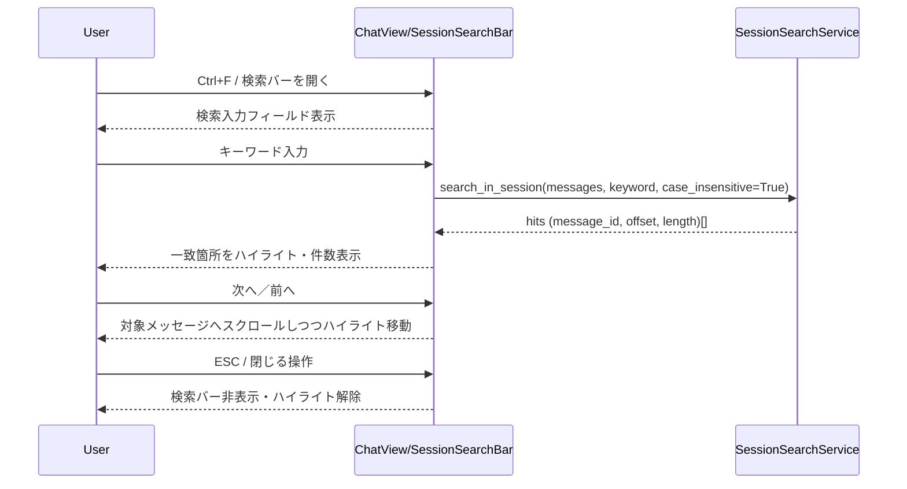
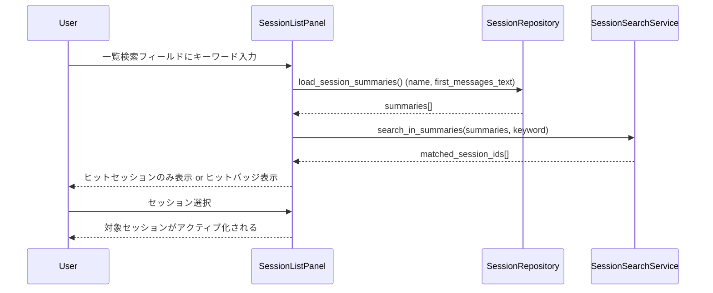
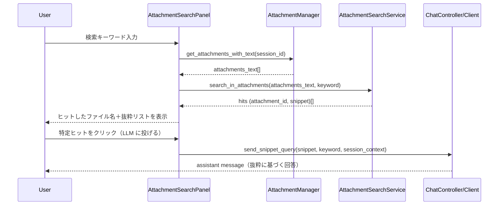

# Design Document

## Overview

本機能は、既存の PySide6 ベース LLM チャットクライアントに「軽量キーワード検索（セッション／セッション一覧／添付テキスト）」を追加し、RAG や常駐インデックスを使わずに、過去の会話や添付テキストを素早く振り返れるようにする。  
セッション内検索（Ctrl+F）、セッション一覧検索、添付テキスト検索を最小限の UI とフルスキャン実装で提供し、「覚えていそうだけどどこに書いたか分からない」「さっきの添付のあの部分だけ見たい」といった現実的なワークフローをサポートする。

### Goals

- 現在のセッション内で、Ctrl+F からキーワード検索・ハイライト・次／前移動ができること
- セッション一覧画面で、セッション名＋冒頭数メッセージを対象にしたキーワード検索で「それっぽいセッション」を素早く絞り込めること
- 抽出済み添付テキストに対して、どのファイルにヒットしたかの簡易一覧と、そこから LLM への補助プロンプト送信ができること
- いずれの検索機能も、その場のフルスキャンのみで完結し、永続的なインデックスやベクタ検索を導入しないこと

### Non-Goals

- ベクタ DB や全文検索エンジンの導入、およびサーバサイド検索機能
- 数千セッション／大量添付を前提とした高スケーラビリティ最適化
- セッション横断の高度な検索 UI（ファセット検索、正規表現検索など）

## Architecture

### Existing Architecture Analysis

- セッションモデル／永続化:
  - `Session` モデルは `models.py` / `session_manager.py` / `session_repository.py` によって JSON 永続化され、メッセージ配列とメタデータを保持している。
  - v1.1 でマルチセッション基盤が導入され、セッション一覧 UI とメタデータロード／アクティブセッションのみ全文ロードという軽量ルールが確立している。
- 添付:
  - v1.4 で `Attachment` サブドメイン（添付メタ＋抽出テキスト）が導入され、セッションごとの添付管理とテキスト抽出フローが設計されている（`AttachmentManager` など）。
- UI:
  - メインウィンドウ（`ui_main.py`）にチャットビュー／セッションリスト／設定ダイアログがあり、ショートカットやメニューアクションはここから束ねられている。

### Architecture Pattern & Boundary Map

検索機能は既存の Session／Attachment 境界の **上に載る横断的な「Query」レイヤ** として実装し、ストレージ実装に依存しすぎない設計とする。

```text
UI
 ├── MainWindow / ChatView
 │    ├── SessionSearchBar （新規: セッション内検索 UI）
 │    └── SessionListSearchBar （新規 or 拡張: セッション一覧検索 UI）
 │
 └── AttachmentSearchPanel （新規: 添付テキスト検索 UI, オプション）

Domain
 ├── SessionManager（既存）
 ├── SessionSearchService（新規: セッション内・一覧検索ロジック）
 └── AttachmentSearchService（新規: 添付テキスト検索ロジック）

Storage
 ├── SessionRepository（既存: セッション JSON）
 └── Attachment/Session attachments（v1.4 設計準拠）
```

- `SessionSearchService` は、アクティブセッションのメッセージ配列、およびセッション一覧のメタ情報を受け取り、シンプルなキーワード一致ロジック（大小文字無視）でヒット位置・件数を返す純粋サービスとする。
- `AttachmentSearchService` は、抽出済み添付テキスト群を入力に受け取り、どの添付にヒットがあるか・周辺抜粋を返す。
- UI はこれらのサービスを呼び出すだけとし、「検索結果のハイライト／スクロール／選択」などの表示責務に限定する。

### Technology Stack

| Layer   | Choice / Role                                   | Notes                                                                                  |
| ------- | ----------------------------------------------- | -------------------------------------------------------------------------------------- |
| UI      | PySide6 `QLineEdit`／`QToolBar`／小型ダイアログ | セッション内検索バー、セッション一覧検索フィールド、添付検索パネル                     |
| Domain  | `SessionSearchService`                          | メッセージテキスト配列からのキーワードマッチ／ヒット位置計算                           |
| Domain  | `AttachmentSearchService`                       | 添付テキスト配列からのヒットファイル一覧と抜粋生成                                     |
| Storage | `SessionRepository`（既存 JSON）                | セッション名＋冒頭数メッセージのサマリ取得、必要時のみフルセッション読み込み           |
| Domain  | 既存 `AttachmentManager`（v1.4）                | 添付メタ＋抽出テキスト取得。検索サービスが直接テキストへアクセスしないようにラップする |

## System Flows

### Flow 1: セッション内検索（Ctrl+F）



### Flow 2: セッション一覧検索



### Flow 3: 添付テキスト検索（オプション）



## Requirements Traceability

| Requirement | Summary                    | Components                                                        | Flows    |
| ----------- | -------------------------- | ----------------------------------------------------------------- | -------- |
| FR-1        | セッション内検索（Ctrl+F） | SessionSearchService, ChatView                                    | Flow 1   |
| FR-2        | セッション一覧検索         | SessionSearchService, SessionList                                 | Flow 2   |
| FR-3        | 添付テキスト検索           | AttachmentSearchService, AttachmentManager, AttachmentSearchPanel | Flow 3   |
| NFR-1       | 軽量性・非インデックス     | SessionSearchService, AttachmentSearchService, SessionRepository  | Flow 1–3 |
| NFR-2       | パフォーマンスと応答性     | SessionSearchService, UI components                               | Flow 1–3 |
| NFR-3       | UX と一貫性                | 検索 UI 群（SearchBar, ListSearch）                               | Flow 1–3 |

## Components and Interfaces

### Domain: SessionSearchService

| Field        | Detail                                                               |
| ------------ | -------------------------------------------------------------------- |
| Intent       | セッション内／セッション一覧に対するキーワード検索ロジックを提供する |
| Requirements | FR-1, FR-2, NFR-1, NFR-2                                             |

**Responsibilities & Constraints**

- メッセージ配列・セッションサマリ配列を受け取り、指定キーワードに対するヒット位置情報を返す
- 大文字小文字無視の単純な部分一致を行い、正規表現や高度な検索オプションは持ち込まない
- 入力が想定以上に大きい場合でも、サービスとしては O(n) スキャンを前提とし、タイムアウト／キャンセルは呼び出し側（UI）で扱う

**Key Methods（案）**

- `search_in_session(messages: list[ChatMessage], keyword: str) -> list[Hit]`
- `search_in_summaries(summaries: list[SessionSummary], keyword: str) -> list[SessionId]`

### Domain: AttachmentSearchService

| Field        | Detail                                                         |
| ------------ | -------------------------------------------------------------- |
| Intent       | 抽出済み添付テキストを対象としたキーワード検索と抜粋生成を行う |
| Requirements | FR-3, NFR-1, NFR-2                                             |

**Responsibilities**

- `AttachmentManager` から提供される `{attachment_id, text}` 配列に対し、キーワードヒットの有無と周辺抜粋を計算する
- 抜粋長や前後の文脈長を一定に保ち、UI での表示と LLM 補助プロンプト生成の双方に使える形で返す

**Key Methods（案）**

- `search_in_attachments(attachments: list[AttachmentText], keyword: str) -> list[AttachmentHit]`

### UI: SessionSearchBar / SessionListSearchBar

| Component            | Domain/Layer | Intent                                     |
| -------------------- | ------------ | ------------------------------------------ |
| SessionSearchBar     | UI           | アクティブセッション内の検索バー           |
| SessionListSearchBar | UI           | セッション一覧ペイン用の検索入力フィールド |

**Responsibilities**

- セッション内検索バー:
  - Ctrl+F で開く／ESC で閉じるショートカットハンドリング
  - キーワード入力ごとに `SessionSearchService` を呼び出し、結果をハイライトとスクロールに反映する
- セッション一覧検索:
  - 入力確定時に `SessionRepository` からサマリを取得し、`SessionSearchService` でヒットセッションを求める
  - 表示フィルタ or ヒットバッジを適用し、ユーザーが対象セッションを素早く選べるようにする

### UI: AttachmentSearchPanel（オプション）

| Field        | Detail                                                   |
| ------------ | -------------------------------------------------------- |
| Intent       | 現在のセッション内添付テキストに対する検索 UI を提供する |
| Requirements | FR-3, NFR-1, NFR-3                                       |

**Responsibilities**

- 添付が存在しない場合は非表示または無効状態を表現する
- キーワード検索結果として「ファイル名＋抜粋＋ヒット件数」を一覧表示する
- 各行から「この抜粋を LLM に投げる」アクションを提供し、`ChatController/Client` に対して適切な user メッセージを構築する

## Data Models

- `Hit` モデル（論理レベル）:
  - フィールド例: `message_id: str`, `char_offset: int`, `length: int`
  - UI 側ではヒット順序（インデックス）も保持して「次へ／前へ」操作に用いる。
- `SessionSummary` モデル:
  - 既存のセッションメタ＋冒頭数メッセージのプレーンテキスト（`preview_text`）を持つ構造体を想定。
  - セッション一覧検索は `name + preview_text` を対象とする。
- `AttachmentText` / `AttachmentHit` モデル:
  - `AttachmentText`: `attachment_id`, `filename`, `text`
  - `AttachmentHit`: `attachment_id`, `filename`, `snippet`, `hit_count`

永続化に新規テーブルやファイル形式は導入せず、既存の JSON 永続化構造（セッション・添付）を前提とする。必要に応じて `SessionRepository` に「サマリだけを返す軽量 API」を追加する。

## Error Handling

- 検索対象データが大きすぎる場合:
  - UI でローディング表示を出しつつ、一定時間を超えたら「検索対象が大きすぎる」旨のメッセージを出して処理を打ち切る（根本的なスケール改善はスコープ外）。
- 添付テキストが未抽出の場合:
  - 添付検索要求が来た時点で `AttachmentManager` 側から「テキストなし」と返ってきた添付はスキップし、必要なら「この添付はまだテキスト抽出されていません」と案内する。
- 入力キーワードが空／短すぎる場合:
  - 1〜2 文字程度では誤爆が多くなるため、「入力が短すぎます」といった軽いバリデーションを UI で行うか、あえて仕様として許容するかを設計レビュー時に決める（本設計では最小 2〜3 文字推奨とする）。

## Testing Strategy

- Unit Tests
  - `SessionSearchService.search_in_session` の大小文字無視マッチング、ヒット位置計算、0 件時の挙動。
  - `SessionSearchService.search_in_summaries` のセッション名／preview_text に対する検索結果の正しさ。
  - `AttachmentSearchService.search_in_attachments` のヒットファイル抽出と抜粋生成ロジック。
- Integration Tests
  - アクティブセッションに対して Ctrl+F から検索し、UI がハイライトとスクロールを正しく行うこと。
  - セッション一覧検索でヒットセッションだけが表示 or バッジ表示され、選択からセッション遷移できること。
  - 添付テキスト検索パネルから LLM 補助プロンプトを投げた際、正しい抜粋を含む user メッセージが送信されること。
- Manual / UI Tests
  - 数十〜数百メッセージ程度のセッションで、検索実行時の体感パフォーマンスを確認。
  - 添付が存在しない／未抽出／大量に存在する場合などの UI 表示とエラーメッセージを確認。
  - 検索 UI のショートカットや見た目が他機能（グローバルホットキー、既存ショートカット）と競合していないかを確認。
