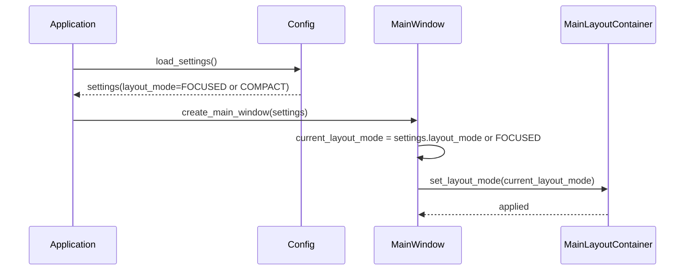
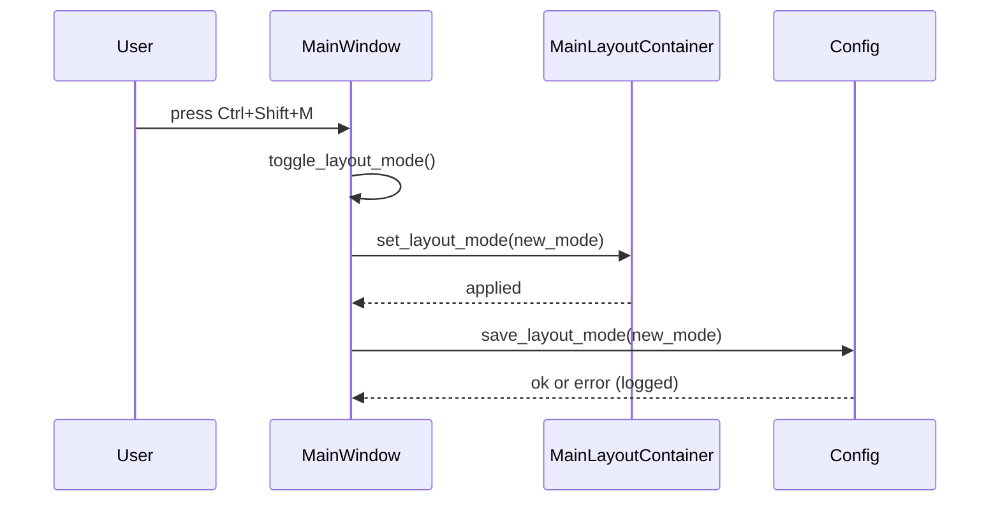
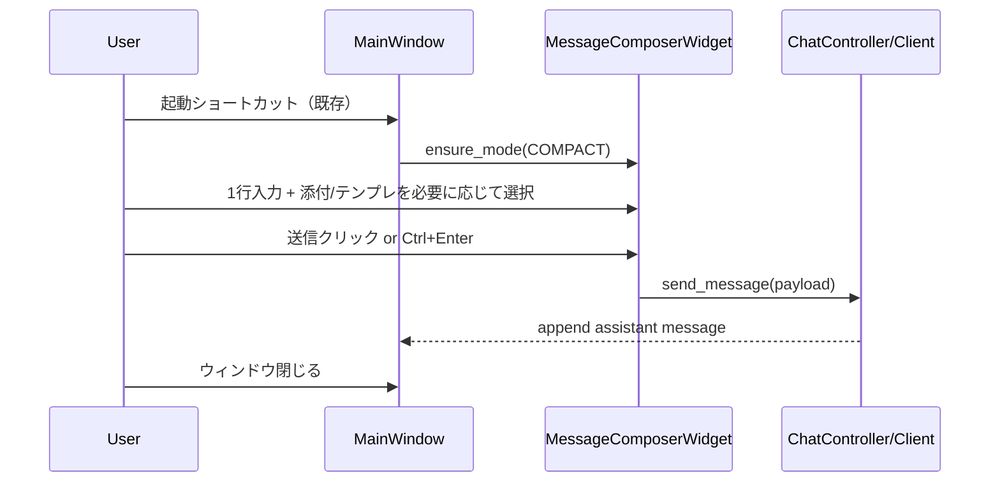

# Design Document

## Overview

本機能は、既存の PySide6 ベース LLM チャットクライアントのメインウィンドウに対して、  
「集中モード（FOCUSED）」と「コンパクトモード（COMPACT）」の二段レイアウトモードを導入し、  
1 つのウィンドウ内で用途に応じて UI 密度を切り替えられるようにする。

集中モードでは Slack 型の 3 ゾーン構成（左サイドバー＋中央チャットログ＋下部メッセージ作成バー）をベースに、  
24 インチモニタの片側半分でも長文対話が快適に行えるレイアウトとタイポグラフィを提供する。  
コンパクトモードでは左サイドバーや補助 UI を畳み、チャットログと入力欄だけにフォーカスした  
「高速キャッチボール」向けの最小 UI を提供する。

### Goals

- 集中モードでチャットログが主役となる Slack 型 3 ゾーンレイアウトを確立すること
- コンパクトモードへの切り替えで、短時間の Q&A を素早く行える最小 UI を提供すること
- レイアウトモードをショートカットで切り替え、前回終了時のモードを復元できること
- 新規/変更 UI の色・フォント・余白をテーマトークン経由で一元管理し、将来のテーマ切り替えに備えること

### Non-Goals

- 新しいウィンドウ（ミニクライアント）の追加
- ライト／ダークテーマ切り替え機能そのもの（スイッチ UI と動的適用）
- セッション管理・添付機能・検索機能など既存ドメイン仕様の変更
- ドラッグ&ドロップやレイアウトプリセット保存など高度なカスタマイズ UI

## Architecture

### Existing Architecture Analysis

- UI:
  - `ui_main.py` に `MainWindow` があり、セッションリスト・チャットビューなどが配置されている。
  - セッションごとのチャット表示や入力欄は `session_widgets.py` などのウィジェット群に分割されている。
- 状態管理:
  - セッションモデルは `models.py` / `session_manager.py` / `session_repository.py` で管理される。
  - アプリ設定は `config.py` 経由で読み書きされる。
- キーボードショートカット:
  - グローバルホットキーは `global_hotkey.py` にまとまっているが、
    ウィンドウ内部でのショートカットは `MainWindow` 側で定義されている。
- テーマ/スタイル:
  - 既存 UI は標準スタイル＋局所的な QSS で構成されており、色や余白が散発的に指定されている。

本機能は「メインウィンドウ内のレイアウトとスタイル」に閉じるため、  
既存のセッションドメインや LLM クライアントロジックには極力手を入れない。

### Architecture Pattern & Boundary Map

- パターン:
  - `MainWindow` に「レイアウトモード」の状態を追加し、
    実レイアウト構成は専用コンポーネント（`MainLayoutContainer` 相当）と
    `MessageComposerWidget` に委譲する。
  - レイアウトモードに応じた表示/非表示切り替えは UI レイヤに閉じ込め、
    ドメインロジックには影響させない。

```text
UI
 ├── MainWindow (ui_main.py)
 │    ├── LayoutMode (enum)
 │    ├── MainLayoutContainer（新規／再構成）
 │    │    ├── LeftSidebarWidget（既存セッションリストのラッパー）
 │    │    └── ChatPanel
 │    │         ├── ChatView（既存: セッションメッセージ表示）
 │    │         └── MessageComposerWidget（新規: 入力＋添付＋テンプレ＋アクション）
 │    └── LayoutModeToggleAction（新規: メニュー／ショートカット）
 │
 └── Theme / Style
      └── theme.py（新規: カラートークン+タイポグラフィ+スペーシング）
```

- 集中モード:
  - `LeftSidebarWidget` を標準幅で表示。
  - `MessageComposerWidget` がフル機能モードで表示される。
- コンパクトモード:
  - `LeftSidebarWidget` を最小幅まで縮小 or 非表示（`QSplitter` で 0 近辺まで）。
  - `MessageComposerWidget` は「1 行入力 + アイコンボタン」構成に縮約される。

### Technology Stack

| Layer  | Choice / Version                      | Role in Feature                                                             | Notes                    |
| ------ | ------------------------------------- | --------------------------------------------------------------------------- | ------------------------ |
| UI     | PySide6 Widgets / QSplitter / QAction | メインレイアウトの 2 分割（サイドバー＋チャット）とモード切り替えアクション | 既存 `MainWindow` を拡張 |
| UI     | `MessageComposerWidget`               | 入力欄・添付・テンプレ・送信などを統合する下部バー                          | コンパクト/集中表示切替  |
| Config | 既存 `config.py`                      | レイアウトモードの保存/復元                                                 | 新規設定キーを追加       |
| Theme  | `theme.py`（新規モジュール）          | カラー/フォント/余白トークンと ThemeRole 定義                               | ライト/ダーク拡張可能    |

## System Flows

### Flow 1: アプリ起動時のレイアウトモード復元



### Flow 2: ショートカットによるモードトグル



### Flow 3: コンパクトモードでの高速 Q&A



## Requirements Traceability

| Requirement | Summary                       | Components                                         | Flows          |
| ----------- | ----------------------------- | -------------------------------------------------- | -------------- |
| FR-1        | 集中モード 3 ゾーンレイアウト | MainWindow, MainLayoutContainer, LeftSidebarWidget | Flow 1         |
| FR-2        | コンパクトモード最小 UI       | MainLayoutContainer, MessageComposerWidget         | Flow 2, Flow 3 |
| FR-3        | モードトグルと状態保持        | MainWindow, Config, MainLayoutContainer            | Flow 1, Flow 2 |
| FR-4        | テーマトークン基盤            | theme.py, ChatView, LeftSidebarWidget, Composer    | -              |
| NFR-1       | 読みやすさと一貫性            | ChatView, theme.py                                 | Flow 1–3       |
| NFR-2       | パフォーマンスと応答性        | MainWindow, MainLayoutContainer                    | Flow 2         |
| NFR-3       | 拡張性と保守性                | MainLayoutContainer, MessageComposerWidget         | 全体           |

## Components and Interfaces

### UI: LayoutMode Enum

| Field        | Detail                                              |
| ------------ | --------------------------------------------------- |
| Intent       | レイアウトモードを表す列挙型 (`FOCUSED`, `COMPACT`) |
| Requirements | FR-1, FR-2, FR-3                                    |

- 実装案:
  - `class LayoutMode(Enum): FOCUSED = "focused"; COMPACT = "compact"`
  - `MainWindow` のメンバとして `current_layout_mode: LayoutMode` を保持。

### UI: MainLayoutContainer

| Field        | Detail                                                                                      |
| ------------ | ------------------------------------------------------------------------------------------- |
| Intent       | 左サイドバーとチャットパネルの 2 分割レイアウトを管理し、モードに応じて幅や表示を切り替える |
| Requirements | FR-1, FR-2, NFR-1, NFR-2, NFR-3                                                             |

**Responsibilities & Constraints**

- `QSplitter` を内部に持ち、左ペイン（サイドバー）と右ペイン（チャットパネル）を配置する。
- `set_layout_mode(mode: LayoutMode)` を公開し、モードに応じて:
  - FOCUSED: 左ペインの幅を「推奨幅」にリセットし、チャットパネルに適度な余白を確保。
  - COMPACT: 左ペイン幅を最小に縮小 or 完全に隠す。
- 既存サイドバーウィジェットをラップして再利用し、内部 API は極力変更しない。

**Dependencies**

- Inbound: `MainWindow` からのモード変更通知。
- Outbound: サイドバー / チャットパネル内部の API（既存機能呼び出し）。

### UI: MessageComposerWidget

| Field        | Detail                                                                     |
| ------------ | -------------------------------------------------------------------------- |
| Intent       | メッセージ入力・送信・添付・テンプレ・補助アクションを一体で扱うコンポーザ |
| Requirements | FR-1, FR-2, NFR-1, NFR-3                                                   |

**Responsibilities & Constraints**

- 集中モード:
  - 複数行テキストエディタ、テンプレ選択コンボボックス、添付一覧、要約/質問ボタンなどを横並び／縦並びで表示。
- コンパクトモード:
  - 1 行入力＋添付/テンプレ/その他アクションはアイコンボタンに集約。
  - 添付一覧はポップオーバー or ダイアログで表示する。
- `set_layout_mode(mode: LayoutMode)` をサポートし、内部でレイアウトの切り替えを完結させる。
- 実際の「送信」イベントは既存のチャット送信ロジック（例: `on_send_message(...)`）に委譲し、API 互換性を維持する。

### UI: LeftSidebarWidget

| Field        | Detail                                                 |
| ------------ | ------------------------------------------------------ |
| Intent       | セッション一覧＋検索 UI をまとめたサイドバーのラッパー |
| Requirements | FR-1, NFR-3                                            |

- 既存のセッションリスト/検索ウィジェットを 1 つのコンテナにまとめ、`MainLayoutContainer` から扱いやすくする。
- コンパクトモードでは `QSplitter` 側の操作で幅が 0 近辺になる前提のため、内部のロジックは変更最小限に留める。

### Theme: theme.py & ThemeRole

| Field        | Detail                                                                                |
| ------------ | ------------------------------------------------------------------------------------- |
| Intent       | 色・フォント・余白トークンと ThemeRole を定義し、新規 UI からのハードコードを排除する |
| Requirements | FR-4, NFR-1, NFR-3                                                                    |

**Responsibilities**

- カラー:
  - 例: `COLOR_BG_MAIN`, `COLOR_BG_SIDEBAR`, `COLOR_BG_CHAT_BUBBLE_USER`, `COLOR_BG_CHAT_BUBBLE_ASSISTANT`, `COLOR_TEXT_PRIMARY`, `COLOR_ACCENT`.
- タイポグラフィ:
  - 例: `FONT_SIZE_TITLE`, `FONT_SIZE_BODY`, `FONT_SIZE_META`, `FONT_FAMILY_DEFAULT`.
- スペーシング:
  - 例: `SPACING_XS`, `SPACING_SM`, `SPACING_MD`, `SPACING_LG`.
- ThemeRole:
  - 例: `ThemeRole.ChatBubbleUser`, `ThemeRole.ChatBubbleAssistant`, `ThemeRole.Sidebar`, `ThemeRole.Composer`.

## Data Models

### Layout Mode Persistence

- Config スキーマ拡張（論理モデル）:
  - 既存の設定オブジェクトに `layout_mode: str` フィールドを追加。
  - 値は `"focused"` / `"compact"` のいずれか、未知値の場合は `"focused"` として扱う。

### Theme Tokens

- 物理的には `theme.py` 内のモジュールレベル定数として保持。
- 将来のライト/ダーク対応では、`get_theme()` 関数で `LightTheme` / `DarkTheme` オブジェクトを返す形に発展させる想定。

## Error Handling

- レイアウトモード値の破損:
  - 設定読み込み時に未知値を検出したらログに記録し、`FOCUSED` にフォールバック。
- モード切り替え時の例外:
  - `set_layout_mode` 内部で例外が発生した場合はキャッチし、ログ出力のうえ UI を既定レイアウトに戻す。
- テーマトークン未定義:
  - 新規 UI が未定義トークンを参照した場合に備え、`theme.py` 側でデフォルト値を返す仕組みを用意する（本機能範囲では設計レベルの注意点として扱う）。

## Testing Strategy

- Unit Tests
  - `LayoutMode` のトグルロジック（FOCUSED ⇔ COMPACT）の単体テスト。
  - `MainLayoutContainer.set_layout_mode` に対するレイアウト状態（サイドバー幅や可視性）の検証。
  - `MessageComposerWidget.set_layout_mode` によるウィジェット表示/非表示の切り替えが要件通りであること。
- Integration / UI Tests
  - アプリ起動時に前回モードが復元されること（設定ファイルを事前に用意して確認）。
  - ショートカットでモードを連続切り替えしても UI が破綻せず、チャット送信がどちらのモードでも成功すること。
  - コンパクトモードで左サイドバーを隠した状態でも、セッション切り替えなど既存機能に退行がないこと。
- Manual / Visual Tests
  - 24 インチモニタを想定し、ウィンドウを画面の片側半分に配置した状態で集中モードの読みやすさを確認。
  - コンパクトモードで「起動 →1〜2 往復対話 → クローズ」のフローがストレスなく行えること。
