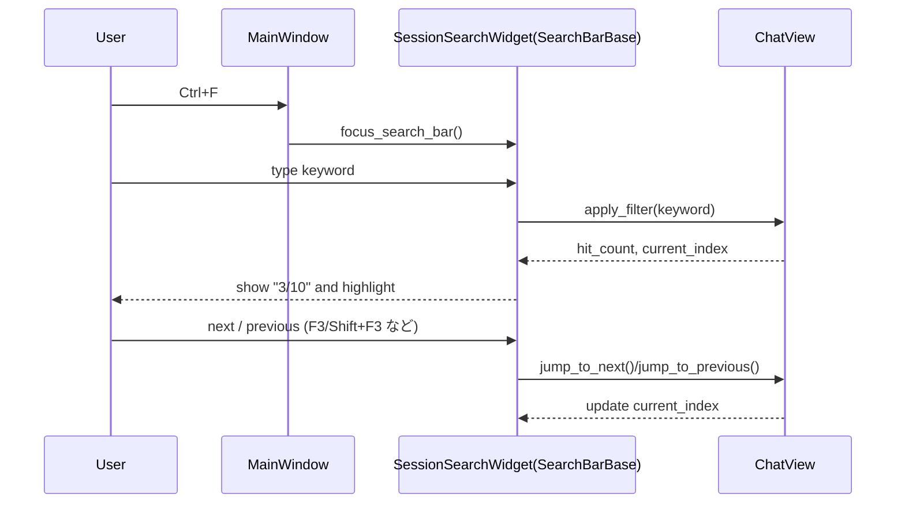
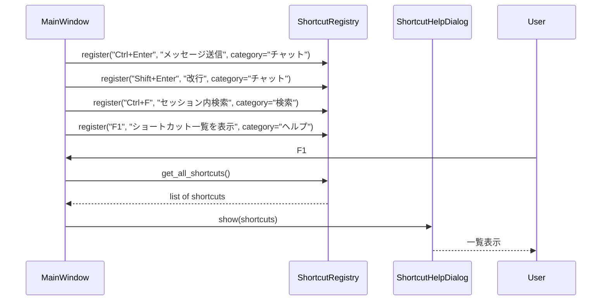
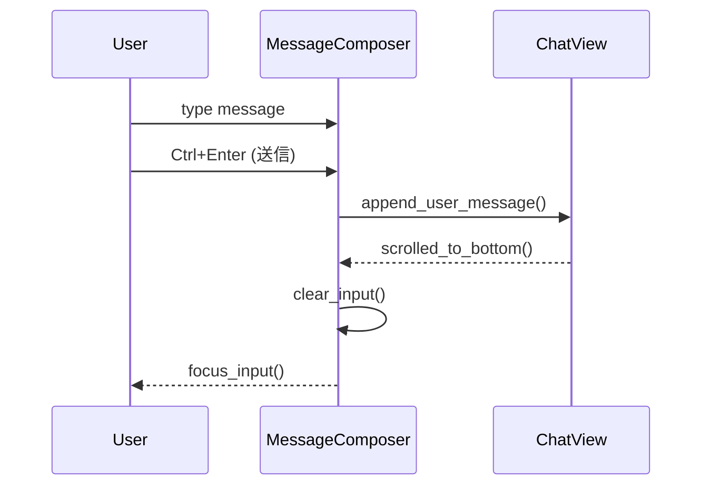

# Design Document

## Overview

本機能は、既存の PySide6 ベース LLM チャットクライアントに対して、  
検索 UI・ショートカット・テンプレート／役割／添付の導線・細かい入力／スクロール挙動を横断的に見直し、  
「使えるけど微妙」な UX ノイズを削減して、日常利用でストレスが少ない状態まで底上げすることを目的とする。

対象は、すでに実装済みの v1.1〜v1.6 機能の「表面操作」とその一貫性であり、  
新しい大機能を足すのではなく、既存 UI の配置・ショートカット設計・導線とフォーカス／スクロール制御を揃えることで、  
ユーザーの認知負荷と無駄な操作を減らす。

### Goals

- 検索 UI（セッション内／セッション一覧／添付テキスト）が共通パターンで操作できること（FR-1）
- グローバルホットキーとアプリ内ショートカットを整理し、1 画面で一覧できること（FR-2）
- テンプレート／役割プロファイル／添付要約・Q&A への導線を短くし、視線移動も最小化すること（FR-3）
- Enter / Shift+Enter 挙動・フォーカス移動・スクロール位置保持に関する UX ノイズを減らすこと（FR-4）
- v1.6 までの機能を壊さずに、操作性だけを改善すること（NFR-1〜3）

### Non-Goals

- 新しい検索種別や RAG 等の大規模検索機能の追加
- OS や他アプリのホットキー仕様そのものの変更
- セッション管理／ストレージ／データモデルの抜本的変更
- レイアウトモード（二段レイアウト等）の再設計そのもの（v1.6 に委譲）

## Architecture

### Existing Architecture Analysis

- 検索:
  - セッション内検索・セッション一覧検索・添付検索は `search_widgets.py` および関連 UI に散在している。
  - 現状は、それぞれでショートカット・ハイライト・ヒット件数表示の挙動が微妙に異なる。
- ショートカット:
  - グローバルホットキーは `global_hotkey.py` で管理され、ウィンドウの前面化等に利用している。
  - アプリ内ショートカット（送信、改行、検索など）は `MainWindow` や各ウィジェット内で個別定義されており、一覧性がない。
- テンプレート／役割／添付導線:
  - `message_composer.py` 周辺にテンプレート挿入・役割表示・添付操作が存在するが、導線が一部離れている。
- フォーカス／スクロール:
  - 送信後フォーカスの戻り先や、検索結果ジャンプ時のスクロール位置保持は場当たり的に実装されており、一貫した「ポリシー」が明文化されていない。

本機能では、**共通化できるパターンを専用コンポーネント／ヘルパに切り出す**ことを優先し、  
ドメインロジックやストレージ層には極力手を入れない。

### Architecture Pattern & Boundary Map

- パターン:
  - 「横断的な UX ルール」を UI レイヤ内の共有コンポーネント／ヘルパとしてまとめる。
  - 検索 UI は共通の `SearchBarBase`（仮）を経由して統一し、各画面固有の検索対象ロジックのみ差し替える。
  - ショートカットは `ShortcutRegistry` と `ShortcutHelpDialog` に集約し、登録と表示を一元化する。
  - フォーカス／スクロール制御は `ChatView`・`MessageComposer` などにポリシーレベルの API を設けて統一する。

```text
UI
 ├── MainWindow (ui_main.py)
 │    ├── ShortcutRegistry（新規、または薄いラッパ）
 │    ├── ShortcutHelpDialog（新規 or 既存ダイアログの正式化）
 │    └── SearchEntryPoints
 │         ├── SessionSearchWidget (search_widgets.py)
 │         ├── SessionListSearchWidget (search_widgets.py)
 │         └── AttachmentSearchWidget (search_widgets.py)
 │
 ├── SearchBarBase（新規: 共通検索バー + 件数表示 + 次/前ジャンプ）
 │    └── 各検索 UI が継承 or 委譲で利用
 │
 ├── MessageComposer (message_composer.py)
 │    ├── TemplateEntry / RoleProfileEntry / AttachmentEntry への統一導線
 │    └── Enter/Shift+Enter 挙動・送信後フォーカス制御
 │
 └── ChatView / SessionView
      └── 検索ハイライト / スクロール位置保持 API
```

- 境界:
  - **検索 UI**: 検索バーの UI パターンは共通化するが、検索対象（どのテキストを走査するか）は各画面側の責務とする。
  - **ショートカット**: 実際のアクション実装は各ウィジェットだが、キー割り当てと説明文は `ShortcutRegistry` に登録して、一元的に参照可能にする。
  - **導線**: テンプレート／役割／添付のドメインロジックは既存コンポーネントに残し、導線だけ `MessageComposer` の UI レイアウト側で調整する。

### Technology Stack

| Layer      | Choice / Version        | Role in Feature                                                              | Notes                          |
| ---------- | ----------------------- | ---------------------------------------------------------------------------- | ------------------------------ |
| UI         | PySide6 Widgets/QActions| 検索バー、ショートカット、ダイアログ構成                                    | 既存構造の上に統一レイヤを追加 |
| UI Helpers | `SearchBarBase`         | 検索キーワード入力、件数表示、次/前ジャンプの共通実装                       | `search_widgets.py` で利用    |
| UI Helpers | `ShortcutRegistry`      | ショートカットの登録・説明文の管理、ヘルプ表示との連携                      | `MainWindow` と統合           |
| UI         | `ShortcutHelpDialog`    | 全ショートカット一覧を表示するダイアログ                                    | グローバル/アプリ内両方を表示 |
| UI         | `MessageComposer`       | 導線の集約、Enter/Shift+Enter/フォーカス挙動の一元化                        | 既存 v1.6 の拡張              |

## System Flows

### Flow 1: セッション内検索の共通パターン



同じフローをセッション一覧検索・添付検索でも使えるよう、`SearchBarBase` は  
「キーワード入力・件数表示・次/前ジャンプ」の UI・キーバインドのみを担当し、  
実際の検索対象はコールバック (`on_search(keyword)`, `on_next()`, `on_prev()`) で差し替える。

### Flow 2: ショートカット登録とヘルプ表示



`ShortcutRegistry` は実体としては単純なテーブル（キー＋説明＋カテゴリ）だが、  
「どこでどのショートカットが定義されているか」を吸い上げる集約ポイントとして機能する。

### Flow 3: メッセージ送信後のフォーカス／スクロール制御



フォーカスとスクロールに関するポリシーは以下のように固定する:
- 送信後は常に入力欄にフォーカスを戻す（マウス不要）。
- 新規メッセージが追加された際は、ユーザーが手動でスクロール位置を固定していない限り、最新メッセージが見える位置まで自動スクロールする。

## Requirements Traceability

| Requirement | Summary                              | Components                                      | Flows        |
| ----------- | ------------------------------------ | ----------------------------------------------- | ------------ |
| FR-1        | 検索 UI の一貫性                    | SearchBarBase, SessionSearchWidget, ChatView    | Flow 1       |
| FR-2        | ホットキーとショートカット整理      | ShortcutRegistry, ShortcutHelpDialog, MainWindow| Flow 2       |
| FR-3        | テンプレ／役割／添付の導線最適化    | MessageComposer, MainWindow                     | Flow 3       |
| FR-4        | 細かい操作性ノイズの削減            | MessageComposer, ChatView                       | Flow 3       |
| NFR-1       | 日常利用でのストレス低減            | 全 UI コンポーネント                            | Flow 1–3     |
| NFR-2       | 一貫性と学習コスト                  | SearchBarBase, ShortcutRegistry, HelpDialog     | Flow 1–2     |
| NFR-3       | 影響範囲と後方互換性                | MainWindow, MessageComposer, Config             | Flow 1–3     |

## Components and Interfaces

### UI: SearchBarBase

| Field        | Detail                                                                                                      |
| ------------ | ----------------------------------------------------------------------------------------------------------- |
| Intent       | 検索キーワード入力・件数表示・次/前ヒット操作を共通パターンとして提供する検索バーコンポーネント             |
| Requirements | FR-1, NFR-1, NFR-2                                                                                          |

**Responsibilities & Constraints**
- キーワード入力用の `QLineEdit`、件数表示ラベル、次/前ジャンプボタン（またはショートカット）を持つ。
- `on_search(keyword: str)`、`on_next()`, `on_prev()` のコールバックを外部から設定できる。
- ヒット件数と現在位置を表示するための API (`update_hits(current, total)`) を提供する。
- キーバインド（例: Enter で検索開始、F3/Shift+F3 で次/前）は SearchBarBase 内で統一する。

### UI: SessionSearchWidget / SessionListSearchWidget / AttachmentSearchWidget

| Field        | Detail                                                                                   |
| ------------ | ---------------------------------------------------------------------------------------- |
| Intent       | 各コンテキスト（チャット本文／セッション一覧／添付テキスト）に対する検索 UI を提供する |
| Requirements | FR-1, NFR-1                                                                              |

**Responsibilities**
- `SearchBarBase` を内部に持ち、対象データ（メッセージ一覧、セッションメタ、添付テキスト）の検索ロジックのみを実装する。
- 各検索結果の位置（行番号、メッセージ ID 等）を `ChatView` やリストビューに渡し、スクロール／選択操作を行う。

### UI: ShortcutRegistry

| Field        | Detail                                                                                     |
| ------------ | ------------------------------------------------------------------------------------------ |
| Intent       | すべてのアプリ内ショートカット（説明・カテゴリ含む）を登録・列挙できるレジストリ           |
| Requirements | FR-2, NFR-2                                                                                |

**Responsibilities & Constraints**
- `register(key: str, description: str, category: str)` でショートカットを登録し、重複キーを検出した場合はログに警告を出す。
- `get_all()` で一覧を返し、`ShortcutHelpDialog` がそれを表示する。
- グローバルホットキー自体は `global_hotkey.py` が扱うが、説明文レベルではここに統合して表示対象とする。

### UI: ShortcutHelpDialog

| Field        | Detail                                                                |
| ------------ | --------------------------------------------------------------------- |
| Intent       | グローバルホットキーとアプリ内ショートカットを 1 画面で一覧表示する   |
| Requirements | FR-2, NFR-2                                                           |

**Responsibilities**
- `ShortcutRegistry` から取得したリストをカテゴリごとにテーブル表示する。
- 検索ボックス（簡易フィルタ）を持ち、ユーザーが目的の操作を探しやすくする。

### UI: MessageComposer

| Field        | Detail                                                                                       |
| ------------ | -------------------------------------------------------------------------------------------- |
| Intent       | メッセージ入力・送信・テンプレート挿入・役割選択・添付要約/質問を統合的に扱うエリア         |
| Requirements | FR-3, FR-4, NFR-1, NFR-3                                                                     |

**Responsibilities & Constraints**
- テンプレート挿入・役割選択・添付要約/質問のトリガとなるボタン／ドロップダウンを入力欄の近傍に集約する。
- Enter / Shift+Enter の挙動を 1 か所で定義し、グローバル設定（ある場合）と UI の説明を一致させる。
- 送信後、入力欄クリアとフォーカス復帰を標準挙動として実装する。

### UI: ChatView / SessionView スクロール API

| Field        | Detail                                                                      |
| ------------ | --------------------------------------------------------------------------- |
| Intent       | 検索結果ジャンプや新規メッセージ追加時のスクロール挙動を一元的に制御する   |
| Requirements | FR-1, FR-4, NFR-1                                                           |

**Responsibilities**
- `jump_to_message(message_id)` や `jump_to_index(index)` など、検索結果からのジャンプに使える API を公開する。
- 「ユーザーが手動でスクロールした場合は自動スクロールを抑制する」といったポリシーを内部で保持する。

## Data Models

本機能では、データモデルの変更は最小限とし、必要に応じて設定スキーマを拡張する。

### Shortcut Metadata

- ショートカット自体はコード内で定義するが、`ShortcutRegistry` で保持するメタ情報は以下のような構造を想定する:

```python
@dataclass
class ShortcutMeta:
    key: str
    description: str
    category: str
    scope: str  # "global" or "app"
```

### Config Extensions (必要であれば)

- 既存の「Enter で送信」設定等があれば、それを再利用しつつ、以下のような論理モデルを採用する:
  - `send_behavior: "enter_to_send" | "ctrl_enter_to_send"`  
    いずれの場合でも、MessageComposer が唯一の実装場所になるようにする。

## Error Handling

- ショートカット衝突:
  - `ShortcutRegistry.register()` で同一キーが登録された場合、ログで警告し、最後に登録されたものを優先する（または登録を拒否する）ポリシーを設計時に決めて明文化する。
- 不正なショートカット定義:
  - PySide6 側で受け付けないキー表現の場合、起動時に例外を握りつぶさずログ＋ユーザー向けメッセージ（設定ミス）に繋げる。
- 検索対象の欠落:
  - 検索対象がロードされていない状態で検索が走った場合は no-op とし、「0/0」表示とログだけに留める。
- スクロール失敗:
  - 表示領域の都合で指定メッセージに完全にスクロールできない場合も、安全側で可能な限り近い位置まで移動する。

## Testing Strategy

- Unit Tests
  - `SearchBarBase` のキーバインドと `update_hits` 表示ロジックのテスト。
  - `ShortcutRegistry` の登録／重複検知／一覧取得のテスト。
  - `MessageComposer` の Enter / Shift+Enter 挙動と送信後フォーカス復帰のテスト。
- Integration / UI Tests
  - セッション内検索・セッション一覧検索・添付検索それぞれで、同じ操作パターンで検索・次/前ジャンプが成功すること。
  - F1（想定）で `ShortcutHelpDialog` が開き、主要ショートカットが全て一覧に含まれること。
  - テンプレート／役割／添付要約/質問の各操作が、メインチャットフローから 2〜3 ステップ以内で到達できること。
  - 送信後も入力欄にフォーカスが残り、長文チャットでスクロール位置が意図通りに維持されること。
- Regression Tests
  - v1.6 までの検索・テンプレート・役割・添付・ホットキーの主要シナリオが退行していないことを、既存テスト＋追加シナリオで確認する。


