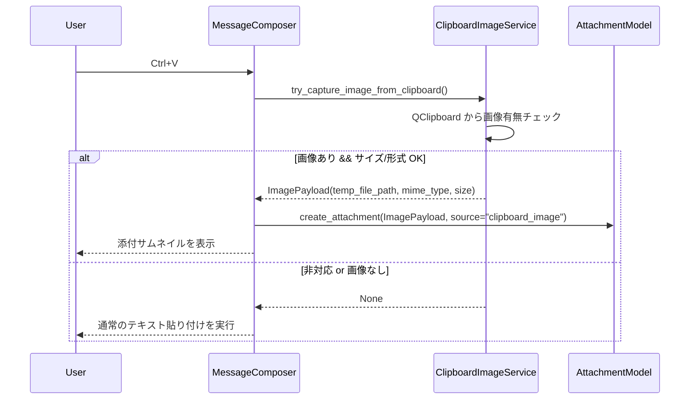
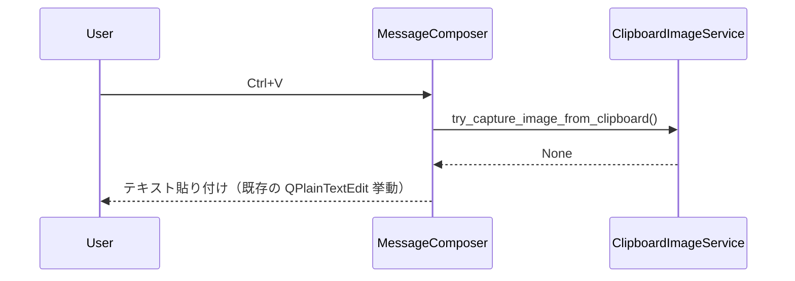
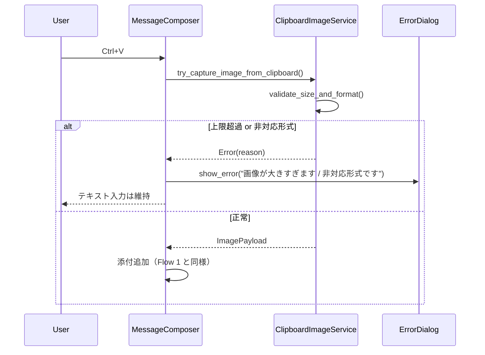

# Design Document

## Overview

本機能は、既存の PySide6 ベース LLM チャットクライアントに対して、  
OS のクリップボード上にあるスクリーンショット等の画像を **標準の貼り付けショートカット（Ctrl+V）** で  
そのままチャットメッセージに添付できるようにすることで、日常的な「画面共有」「エラー報告」「資料抜粋」の摩擦を減らすことを目的とする。

ユーザーはこれまで、画像共有のたびに「スクショを撮る → ファイルとして保存 → 添付ダイアログから選択」という  
冗長な手順を踏む必要があった。本機能では、すでに存在する v1.4 の軽量ファイル添付基盤を再利用しつつ、  
クリップボードからの画像取得〜添付生成〜UI 表示〜送信までを一気通貫で扱う薄いレイヤを追加する。

### Goals

- Ctrl+V 一発で「今見ている画面」をチャットに共有できること（FR-1, FR-2）
- 画像添付が既存のファイル添付と同じ概念で扱われ、履歴や再利用の UX が揃っていること（FR-2, FR-3）
- 画像が存在しない／巨大すぎる／非対応形式といったケースでも、アプリが落ちずに妥当なエラーハンドリングを行うこと（FR-4, NFR-1）
- Ctrl+V の挙動がテキスト貼り付けとの整合性を保ちつつ、ヘルプやショートカット一覧に明示されていること（NFR-2）

### Non-Goals

- 画像編集機能（トリミング・モザイク・注釈）の提供
- OCR や画像→テキスト変換機能の提供
- 画像ストレージの抜本的な見直し（クラウド連携や専用 CDN 等）
- 添付モデル全体の再設計（v1.4 の枠から外れる大規模変更）

## Architecture

### Existing Architecture Analysis

- 添付機能:
  - v1.4 の「軽量ファイル添付」が `attachments.py` および関連 UI（メッセージコンポーザ周辺）として存在する想定。
  - 添付は「メッセージに紐づくファイルオブジェクト」として扱われ、ファイルパスやメタ情報を保持している。
- メッセージ入力/UI:
  - メインの入力エリアは `message_composer.py`（または同等のコンポーネント）で実装されている。
  - 既にテキストの貼り付け（Ctrl+V）は標準の `QPlainTextEdit` / `QTextEdit` 挙動に依存している。
- クリップボード:
  - Qt の `QClipboard` / `QMimeData` を通じてテキスト・画像などを取得可能だが、現状はテキスト以外を積極的に扱っていない。

本機能では、**既存の添付モデルとメッセージコンポーザを拡張する**形を取り、  
新しい巨大コンポーネントは作らず、小さなユーティリティと UI 差分で実現する。

### Architecture Pattern & Boundary Map

- パターン:
  - 「クリップボードから画像を取り出して添付オブジェクトを生成する責務」を UI から切り出し、  
    小さなサービス／ヘルパ（例: `ClipboardImageService`）としてまとめる。
  - メッセージコンポーザは「Ctrl+V が押されたときに、テキストと画像のどちらをどう扱うか」というポリシーのみを担当する。
  - 添付の永続化と送信は既存の添付フローに委譲し、仕様の重複を避ける。

```text
UI
 ├── MessageComposer (message_composer.py)
 │    ├── テキスト入力 (QPlainTextEdit 等)
 │    ├── 添付サムネイル一覧 (既存 Attachments UI)
 │    └── Ctrl+V ハンドリング
 │         ├── ClipboardImageService に問い合わせ
 │         └── 画像があれば添付追加 / なければ通常テキスト貼り付け
 │
 ├── AttachmentThumbnailList (既存 or 拡張)
 │    └── 添付画像のサムネイル表示と削除ボタン
 │
 └── Error / Notification UI
      └── 画像サイズ上限超過・非対応形式などのユーザー向けメッセージ

Domain / Service
 ├── Attachment Model (attachments.py)
 │    ├── file_path
 │    ├── mime_type
 │    ├── size_bytes
 │    └── source ("user_file" / "clipboard_image" など)
 │
 └── ClipboardImageService (新規)
      ├── クリップボードから画像を取得
      ├── 上限サイズ・形式チェック
      └── 一時ファイル or メモリストレージへの保存
```

- 境界:
  - **UI レイヤ**: Ctrl+V のキーハンドリング、画像添付の追加・削除、サムネイル表示。
  - **サービスレイヤ**: クリップボードの生データ取得、フォーマット判定、サイズ検査、一時ファイル保存。
  - **ドメインモデル**: 添付のメタ情報（パス・MIME・サイズ・source）管理と、既存の送信フローとの統合。

### Technology Stack

| Layer   | Choice / Version        | Role in Feature                                             | Notes                                   |
|--------|-------------------------|-------------------------------------------------------------|-----------------------------------------|
| UI     | PySide6 Widgets         | メッセージ入力・添付サムネイル・エラーダイアログ表示       | 既存コンポーネントを拡張               |
| UI     | `QClipboard` / `QMimeData` | クリップボードから画像データを取得                       | Qt 標準 API を利用                      |
| Domain | `attachments.py`        | 添付モデルの拡張（画像 MIME/サイズ/source フラグなど）     | v1.4 の設計に沿って拡張                |
| Service| `ClipboardImageService` | 画像取得・検証・一時保存ロジックの集約                     | テストしやすい関数/クラスとして実装    |
| FS     | 一時ディレクトリ        | クリップボード画像をファイルとして保存して添付と紐づける   | パスは設定/定数から取得（ハードコード回避） |

## System Flows

### Flow 1: 画像のみが存在する場合の Ctrl+V 貼り付け



ポリシー:
- 「クリップボードに画像があり、かつテキスト入力欄が空」の場合は画像添付を優先し、テキストは無視してよい。
- 「すでにテキストを入力済み」の場合は、画像があっても通常テキスト貼り付けを優先する（誤爆防止）。

### Flow 2: 画像が存在しない場合の Ctrl+V



アプリはクラッシュせず、既存のテキスト貼り付けと同等の UX を維持する。

### Flow 3: サイズ上限超過・非対応形式



## Requirements Traceability

| Requirement | Summary                                    | Components / Services                       | Flows               |
|------------|--------------------------------------------|---------------------------------------------|---------------------|
| FR-1       | Ctrl+V によるクリップボード画像貼り付け   | MessageComposer, ClipboardImageService      | Flow 1, Flow 2      |
| FR-2       | 添付として一貫した取り扱い                 | AttachmentModel, MessageComposer            | Flow 1              |
| FR-3       | UI 表示と削除操作                          | AttachmentThumbnailList, MessageComposer    | Flow 1              |
| FR-4       | エラー処理とバリデーション                 | ClipboardImageService, ErrorDialog          | Flow 3              |
| NFR-1      | パフォーマンスと応答性                     | ClipboardImageService, FS                   | Flow 1–3            |
| NFR-2      | UX と誤操作防止                            | MessageComposer, ShortcutHelp/Docs          | Flow 1–2            |
| NFR-3      | セキュリティとプライバシー                 | AttachmentModel, ClipboardImageService, FS  | Flow 1–3            |

## Components and Interfaces

### UI: MessageComposer 拡張

| Field        | Detail                                                                                         |
|-------------|------------------------------------------------------------------------------------------------|
| Intent      | メッセージ入力・送信・ファイル/画像添付の起点となるコンポーザ。Ctrl+V の挙動ポリシーを一元管理する |
| Requirements| FR-1, FR-2, FR-3, NFR-1, NFR-2                                                                 |

**Responsibilities & Constraints**
- キーイベント（Ctrl+V）をフックし、`ClipboardImageService` に問い合わせた上で「画像添付」か「通常テキスト貼り付け」かを決定する。
- 添付が追加された場合は既存の添付一覧 UI に反映し、削除操作も同じコンポーネント内で完結させる。
- 画像が添付されてもメッセージ本文テキストは独立して管理される（削除操作で本文が消えない）。

### Service: ClipboardImageService

| Field        | Detail                                                                                 |
|-------------|----------------------------------------------------------------------------------------|
| Intent      | クリップボードから画像データを安全に取得し、サイズ/形式チェックと一時保存を行うサービス |
| Requirements| FR-1, FR-4, NFR-1, NFR-3                                                               |

**Responsibilities**
- Qt の `QClipboard` から画像データを取得し、利用可能な形式（例: PNG, JPEG）のみを受け入れる。
- 最大サイズ（バイト数）とピクセル数の上限を設定値／定数から読み込み、超過時は `Error` を返す。
- 妥当な画像の場合は一時ディレクトリにファイルとして保存し、`temp_file_path`, `mime_type`, `size_bytes` を返す。

**Interface (イメージ)**

```python
class ClipboardImageService:
    def try_capture_image(self) -> tuple[ImagePayload | None, ClipboardImageError | None]:
        ...

@dataclass
class ImagePayload:
    path: Path
    mime_type: str
    size_bytes: int
```

### Domain: Attachment Model 拡張

| Field        | Detail                                                                  |
|-------------|-------------------------------------------------------------------------|
| Intent      | 既存の添付モデルに「クリップボード画像」というソース種別を追加して扱う |
| Requirements| FR-2, FR-3, NFR-3                                                       |

**Responsibilities**
- `source` フィールドに `"clipboard_image"` を追加し、後続の処理やログで識別可能にする。
- 画像の場合、`mime_type` が `image/*` であること、`size_bytes` が上限内であることを前提とする。

## Data Models

### Attachment 拡張

- 論理モデル:

```python
@dataclass
class Attachment:
    id: str
    file_path: Path
    mime_type: str
    size_bytes: int
    source: str  # "user_file" | "clipboard_image" | ...
```

- 上限値やサポート形式は、`config.py` か専用の設定モジュールにまとめ、ハードコードを避ける。

### 一時ファイル管理

- 一時ディレクトリパスは OS ごとの適切な場所（例: `%LOCALAPPDATA%/win-llm-chat/tmp`）を  
  起動時に解決し、`ClipboardImageService` から参照する。
- クリーンアップ戦略:
  - 送信済みメッセージに紐づく画像は、添付の永続化戦略に従って必要な期間保持。
  - 送信前にウィンドウが閉じられた場合など、孤立した一時ファイルは定期的な GC（起動時 or 明示的メンテナンス）で削除する。

## Error Handling

- 画像なし / 非画像クリップボード:
  - `ClipboardImageService` は `None` を返し、MessageComposer はテキスト貼り付けにフォールバックする。
- サイズ上限超過 / 非対応形式:
  - サービスがエラー種別を返し、UI はユーザー向けメッセージ（簡潔なダイアログ or トースト）を表示する。
- 一時ファイル保存失敗:
  - ディスクフルやパーミッションエラーなどの場合はエラーとして扱い、  
    「画像を添付できませんでした（保存に失敗しました）」と表示し、アプリは継続動作する。

## Testing Strategy

- Unit Tests
  - `ClipboardImageService` が画像あり/なし/非対応形式/サイズ超過を正しく判定すること。
  - 一時ファイル保存時に、許可されたパスとサイズ上限を守っていること。
- Integration / UI Tests
  - クリップボードに PNG スクリーンショットがある状態で Ctrl+V → 添付サムネイルが表示され、送信後に履歴で画像付きメッセージとして見えること。
  - 画像がない状態で Ctrl+V → テキスト貼り付けが既存と同じ挙動になること。
  - サイズ上限超過の画像で Ctrl+V → エラーメッセージ表示＋添付されないこと。
  - 送信前にサムネイルの × ボタンで画像を削除しても、メッセージ本文と他の添付が維持されること。
- Regression Tests
  - 既存のファイル添付（ドラッグ＆ドロップやファイルダイアログ）機能が退行していないこと。
  - Ctrl+V による純粋なテキスト貼り付けシナリオ（画像を含まない）の挙動が変化していないこと。


