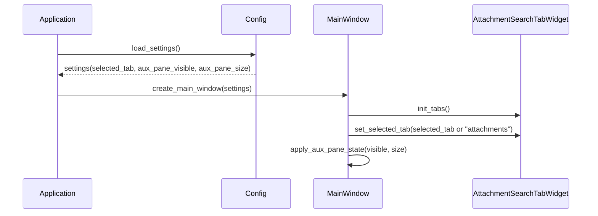
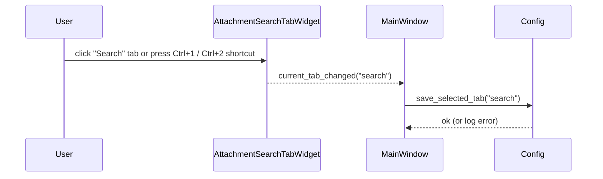
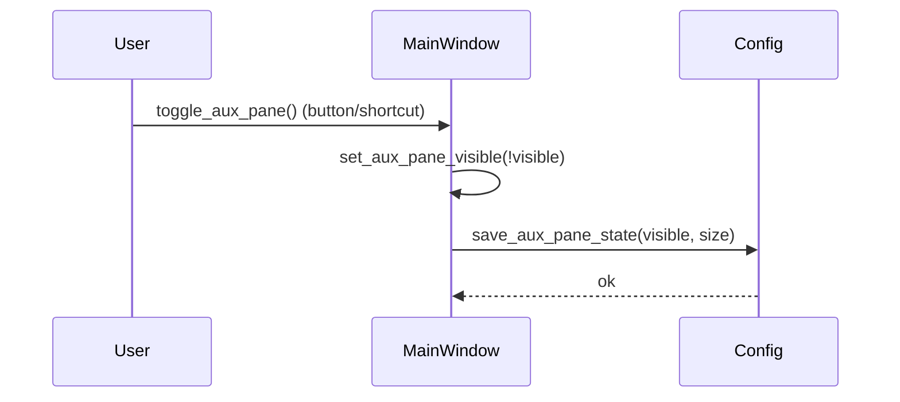

# Design Document

## Overview

本機能は、既存の PySide6 ベース LLM チャットクライアントのメインウィンドウにおいて、  
添付ファイル管理 UI と検索 UI を「同一ペイン内のタブ」として再構成しつつ、チャット表示領域を最大化することを目的とする。  
ユーザーはチャット本文の閲覧・編集を主軸にしながら、必要なタイミングで添付・検索タブを切り替えて補助情報にアクセスする。

これにより、従来の「横に色々詰め込んで狭くなる」レイアウトから、  
チャット中心でありながら必要十分な補助ペインを呼び出せる構成へと移行する。  
添付・検索のドメインロジックは極力既存実装を再利用し、UI レイアウトと状態管理のみに変更範囲を閉じ込める。

### Goals

- 添付・検索 UI をタブ化し、同時表示を避けつつ切り替えを素早く行えるようにすること
- チャット表示領域を従来より広く保ち、特に横幅の狭い環境での可読性を向上させること
- タブ選択状態・ペインの表示／非表示・幅を永続化し、起動時に復元できること
- 既存の添付・検索のロジックを再利用し、改修コストとリスクを最小限に抑えること

### Non-Goals

- 添付メタデータ構造や保存方式の刷新
- 検索アルゴリズム・インデックス構造・検索条件の追加や変更
- マルチウィンドウ化やドッキング UI など高度なレイアウトカスタマイズ
- 添付・検索以外の情報ペイン（プロファイル、診断など）の同時実装

## Architecture

### Existing Architecture Analysis

- UI:
  - `ui_main.py` の `MainWindow` がメインレイアウトを構成し、セッションやチャットビューを保持している。
  - 添付関連 UI は `attachment_widgets.py` / `attachments.py`、検索 UI は `search_widgets.py` / `search_services.py` によって構成されている。
- 状態管理:
  - セッションとメッセージは `models.py` / `session_manager.py` / `session_repository.py` が扱う。
  - 設定値は `config.py` 経由で永続化される。
- レイアウト:
  - 現状、添付・検索 UI はチャット周辺に別々のペインやパネルとして配置されており、チャット表示領域を圧迫しやすい。

本機能では、添付・検索 UI を一段抽象化した「タブコンテナ」に集約し、  
チャット領域とのレイアウト関係を `MainWindow` 側から明示的に制御する。

### Architecture Pattern & Boundary Map

- パターン:
  - メインウィンドウ配下に「補助ペインコンテナ」を追加し、その内部にタブウィジェットを配置する。
  - 添付・検索のウィジェットはタブの中身としてラップされ、既存の API を極力そのまま利用する。
  - タブ選択状態とペインの表示／非表示は、設定値＋実行時状態として UI レイヤで完結させる。

```text
UI
 ├── MainWindow (ui_main.py)
 │    ├── ChatArea (既存: セッションチャットビュー)
 │    ├── AuxiliaryPaneContainer（新規）
 │    │    └── AttachmentSearchTabWidget（新規）
 │    │         ├── AttachmentTabPage（既存 Attachment UI のラッパー）
 │    │         └── SearchTabPage（既存 Search UI のラッパー）
 │    └── Actions / Shortcuts（タブ切り替え、ペイン表示切替）
 │
 └── Domain
      ├── attachments.py / attachment_widgets.py（既存）
      └── search_services.py / search_widgets.py（既存）
```

- 補助ペインコンテナは、チャットエリアとの縦または横の分割レイアウトに組み込まれ、  
  折り畳み・リサイズを通じてチャット領域の拡張を制御する。

### Technology Stack

| Layer  | Choice / Version               | Role in Feature                                 | Notes                            |
| ------ | ------------------------------ | ----------------------------------------------- | -------------------------------- |
| UI     | PySide6 QTabWidget / QWidget   | 添付・検索をタブとしてまとめるコンテナ          | 新規 `AttachmentSearchTabWidget` |
| UI     | 既存 Attachment/Search Widgets | タブ内のコンテンツとして利用                    | 既存ロジックをラップする         |
| UI     | QSplitter / レイアウト管理     | チャット領域と補助ペインの表示比率を管理        | MainWindow で制御                |
| Config | 既存 `config.py`               | 最終選択タブ種別・ペイン表示状態・幅の保存/復元 | 新規設定キーを追加               |

## System Flows

### Flow 1: アプリ起動時のタブ・レイアウト復元



### Flow 2: タブ切り替え



### Flow 3: 補助ペインの開閉とチャット領域拡張



## Requirements Traceability

| Requirement | Summary                          | Components                            | Flows        |
| ----------- | -------------------------------- | ------------------------------------- | ------------ |
| FR-1        | 添付・検索 UI のタブ化           | AttachmentSearchTabWidget, TabPages   | Flow 1, 2    |
| FR-2        | チャット表示領域の拡張           | MainWindow, AuxiliaryPaneContainer    | Flow 1, 3    |
| FR-3        | タブ切り替えとフォーカス遷移     | AttachmentSearchTabWidget, SearchPage | Flow 2       |
| FR-4        | 状態保持（タブ・ペイン・サイズ） | Config, MainWindow                    | Flow 1, 2, 3 |
| FR-5        | 既存機能の維持                   | 既存 Attachment/Search Widgets        | Flow 1–3     |
| NFR-1       | 可読性と集中度                   | MainWindow, ChatArea, AuxiliaryPane   | Flow 1, 3    |
| NFR-2       | 操作性と発見可能性               | AttachmentSearchTabWidget, Actions    | Flow 2       |
| NFR-3       | パフォーマンス                   | MainWindow, Tabs                      | Flow 2, 3    |
| NFR-4       | 拡張性・実装方針                 | AttachmentSearchTabWidget, TabPages   | 全体         |

## Components and Interfaces

### UI: AttachmentSearchTabWidget

| Field        | Detail                                                           |
| ------------ | ---------------------------------------------------------------- |
| Intent       | 添付タブ・検索タブをまとめて管理し、選択状態とイベントを提供する |
| Requirements | FR-1, FR-3, FR-4, NFR-2, NFR-4                                   |

**Responsibilities & Constraints**

- `QTabWidget` または同等のタブコンポーネントとして実装し、「添付」「検索」の 2 タブを持つ。
- タブ選択変更時にシグナル（例: `tab_changed(name: str)`）を発火し、`MainWindow` に通知する。
- 検索タブをアクティブにした際、内部で検索入力欄にフォーカスを移す。
- `shortcut_registry` 相当の仕組みを用いて、`Ctrl+1` で添付タブ、`Ctrl+2` で検索タブを選択するショートカットを登録する。
- 既存の添付・検索ウィジェットを子として保持し、その public API を尊重する。

### UI: AttachmentTabPage

| Field        | Detail                                   |
| ------------ | ---------------------------------------- |
| Intent       | 既存添付 UI をタブページとしてラップする |
| Requirements | FR-1, FR-5, NFR-4                        |

- 既存の添付一覧・操作ウィジェットを内包しつつ、タブページとして最小限の追加インターフェースのみを提供。
- レイアウト・スクロールなどの調整はここで完結させ、ドメインロジックをいじらない。

### UI: SearchTabPage

| Field        | Detail                                                       |
| ------------ | ------------------------------------------------------------ |
| Intent       | 既存検索 UI をタブページとしてラップし、フォーカス制御を担う |
| Requirements | FR-1, FR-3, FR-5, NFR-2, NFR-4                               |

- 既存検索ウィジェットを内包し、「タブがアクティブになったら検索入力へフォーカスする」責務を持つ。

### UI: AuxiliaryPaneContainer

| Field        | Detail                                                           |
| ------------ | ---------------------------------------------------------------- |
| Intent       | チャットエリアとのレイアウト関係（分割・開閉・サイズ）を管理する |
| Requirements | FR-2, FR-4, NFR-1, NFR-3                                         |

- `QSplitter` 等でチャットエリアとタブペインを分割し、開閉・サイズ変更を API として提供する。
- 「非表示」状態ではチャットエリアが最大化されるようにサイズを調整する。

### Config: Layout Persistence Keys

| Field        | Detail                           |
| ------------ | -------------------------------- |
| Intent       | タブ種別・ペイン状態・サイズ保存 |
| Requirements | FR-4                             |

- 新規キー例:
  - `ui.aux_pane.visible: bool`
  - `ui.aux_pane.size: int or list[int]`
  - `ui.aux_pane.selected_tab: str ("attachments" / "search")`

## Data Models

- 既存の添付・検索データモデルは変更しない。
- 追加されるのは UI 設定用のキーのみで、`config.py` の設定構造にフィールドを追加する。

## Error Handling

- 設定値の破損（未知のタブ名・不正なサイズ）:
  - ログ出力の上、デフォルト値（添付タブ・可視・標準サイズ）で初期化する。
- タブ切り替え／開閉時の例外:
  - UI レベルでキャッチし、チャットエリアのみでもアプリが使える状態を維持する。

## Testing Strategy

- Unit Tests
  - `AttachmentSearchTabWidget` のタブ変更時に正しいシグナルが発行されること。
  - `SearchTabPage` でタブアクティブ時に検索入力へフォーカスが移ること。
  - 設定値読み込み時に未知値をフォールバックできること。
- Integration / UI Tests
  - 起動時に前回のタブ・ペイン状態が復元されること。
  - 補助ペインの開閉やリサイズでチャット領域が期待通りに拡張・縮小されること。
  - 添付・検索の主要操作フローがタブ化後も成功すること（退行がないこと）。
